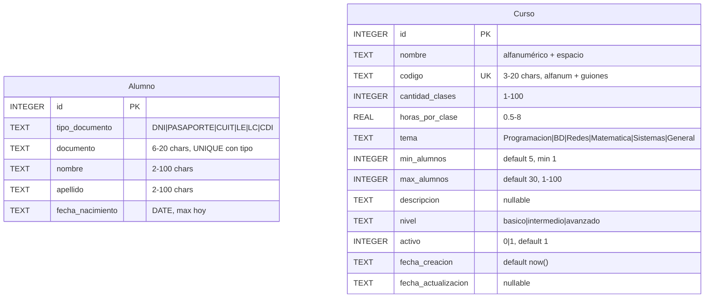
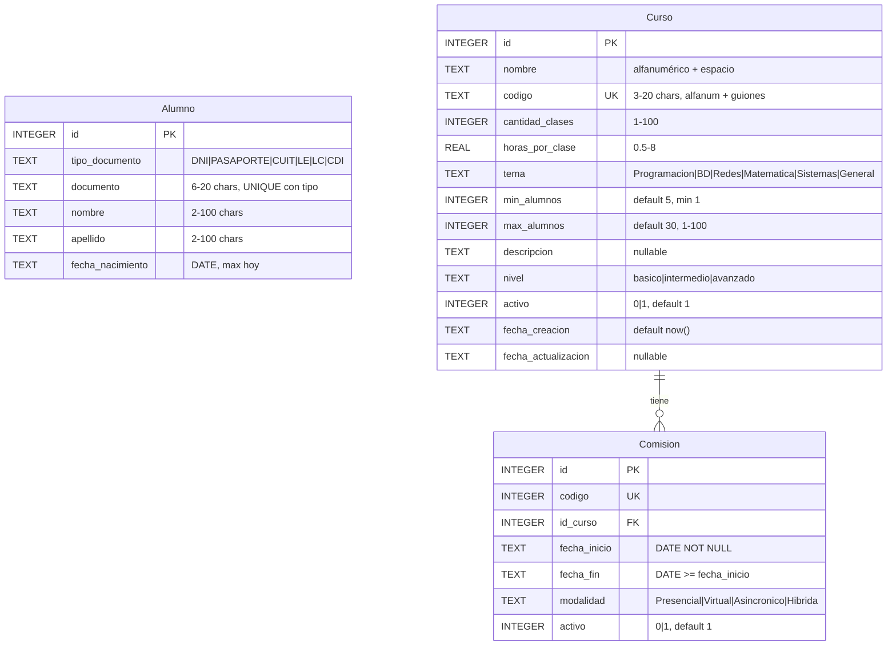

# Repaso

* SQL (con SQLite)
  * DBBrowser
  * Crear tablas
    * Contraints
      * CHECK
        * GLOB (Expresiones Regulares)
      * UNIQUE
      * NOT NULL
    * Uso de IA y Reglas
      * Estudiar las reglas para que los registros sean consistentes
      * Utilizar la IA para analizar la tabla creada y que tenga todos los constraints
      * Claude me hacia preguntas de una (Patron interaccion)
  * Creamos Tablas
    * Alumno
    * Curso
* SQL
  * Select
  * DML
    * INSERT
    * UPATE
  * DDL
    * ALTER TABLE
    * DROP

# Base de Datos

## Reconstruyendo la base

* Tabla Alumno
  
```sql
CREATE TABLE Alumno (
    id               INTEGER PRIMARY KEY AUTOINCREMENT,
    tipo_documento   TEXT    NOT NULL,
    documento        TEXT    NOT NULL,
    nombre           TEXT    NOT NULL,
    apellido         TEXT    NOT NULL,
    fecha_nacimiento TEXT    NOT NULL,

    CONSTRAINT ck_tipo_documento CHECK (
        tipo_documento IN ('DNI', 'PASAPORTE', 'CUIT', 'LE', 'LC', 'CDI')
    ),
    CONSTRAINT ck_documento CHECK (
        LENGTH(TRIM(documento)) BETWEEN 6 AND 20
    ),
    CONSTRAINT ck_nombre CHECK (
        LENGTH(TRIM(nombre)) BETWEEN 2 AND 100
    ),
    CONSTRAINT ck_apellido CHECK (
        LENGTH(TRIM(apellido)) BETWEEN 2 AND 100
    ),
   CONSTRAINT ck_fecha_nacimiento CHECK (
       fecha_nacimiento GLOB '[0-9][0-9][0-9][0-9]-[0-9][0-9]-[0-9][0-9]'
       AND SUBSTR(fecha_nacimiento, 1, 4) BETWEEN '1900' AND '2100'
       AND SUBSTR(fecha_nacimiento, 6, 2) BETWEEN '01' AND '12'
       AND SUBSTR(fecha_nacimiento, 9, 2) BETWEEN '01' AND '31'
   )
    CONSTRAINT uq_tipo_documento UNIQUE (tipo_documento, documento)
);
```

> [!NOTE]
> Tuve que corregir la tabla alumno porque no puedo usar la funcion DATE('now') en la creacion
> Tuve que cabiar esto


```sql
     CONSTRAINT ck_fecha_nacimiento CHECK (
        DATE(fecha_nacimiento) IS NOT NULL
        AND DATE(fecha_nacimiento) = fecha_nacimiento
        AND fecha_nacimiento <= DATE('now')
        AND SUBSTR(fecha_nacimiento, 1, 4) BETWEEN '1900' AND '2100'
    ),
```

* Curso

```sql
CREATE TABLE Curso (
    id          INTEGER     NOT NULL
                            CONSTRAINT pk_curso PRIMARY KEY AUTOINCREMENT,

    nombre      TEXT        NOT NULL
                            CONSTRAINT ck_nombre_no_vacio  CHECK (LENGTH(TRIM(nombre)) > 0)
                            CONSTRAINT ck_nombre_formato   CHECK (nombre GLOB '[A-Za-z0-9 ]*'),

    codigo      TEXT        NOT NULL
                            CONSTRAINT uq_codigo           UNIQUE
                            CONSTRAINT ck_codigo_longitud  CHECK (LENGTH(TRIM(codigo)) BETWEEN 3 AND 20)
                            CONSTRAINT ck_codigo_formato   CHECK (codigo GLOB '[A-Za-z0-9-_]*'),

    cantidad_clases INTEGER NOT NULL
                            CONSTRAINT ck_cantidad_clases  CHECK (cantidad_clases BETWEEN 1 AND 100),

    horas_por_clase REAL    NOT NULL
                            CONSTRAINT ck_horas_por_clase  CHECK (horas_por_clase BETWEEN 0.5 AND 8),

    tema        TEXT        NOT NULL
                            CONSTRAINT ck_tema_no_vacio    CHECK (LENGTH(TRIM(tema)) > 0)
                            CONSTRAINT ck_tema_enum        CHECK (tema IN ('Programacion', 'Base de Datos', 'Redes', 'Matematica', 'Sistemas', 'General')),

    min_alumnos INTEGER     NOT NULL DEFAULT 5
                            CONSTRAINT ck_min_alumnos      CHECK (min_alumnos >= 1),

    max_alumnos INTEGER     NOT NULL DEFAULT 30
                            CONSTRAINT ck_max_alumnos      CHECK (max_alumnos BETWEEN 1 AND 100),

    descripcion TEXT,

    nivel       TEXT        NOT NULL DEFAULT 'basico'
                            CONSTRAINT ck_nivel            CHECK (nivel IN ('basico', 'intermedio', 'avanzado')),

    activo      INTEGER     NOT NULL DEFAULT 1
                            CONSTRAINT ck_activo           CHECK (activo IN (0, 1)),

    fecha_creacion      TEXT NOT NULL DEFAULT (datetime('now')),
    fecha_actualizacion TEXT,

    CONSTRAINT ck_rango_alumnos CHECK (min_alumnos <= max_alumnos)
```

* DER



* Agregar Datos

* Quiero el insert para 3 alumnos y 3 cursos

```sql
INSERT INTO Alumno (tipo_documento, documento, nombre, apellido, fecha_nacimiento) VALUES
    ('DNI', '38472910', 'Lucía', 'Fernández', '2001-03-15'),
    ('DNI', '41285673', 'Mateo', 'Gómez', '2003-07-22'),
    ('PASAPORTE', 'AAB123456', 'Valentina', 'López', '2000-11-08');

INSERT INTO Curso (nombre, codigo, cantidad_clases, horas_por_clase, tema, min_alumnos, max_alumnos, descripcion, nivel, activo) VALUES
    ('Introduccion a Python',  'PY-101',  20, 1.5, 'Programacion', 5, 25, 'Fundamentos de programacion con Python',      'basico',      1),
    ('Base de Datos Avanzada', 'BD-301',  15, 2.0, 'Base de Datos', 3, 20, 'Optimizacion y administracion de bases SQL', 'avanzado',    1),
    ('Redes y Conectividad',   'RD-201',  12, 1.5, 'Redes',         4, 30, 'Protocolos, topologias y configuracion LAN', 'intermedio',  1);
```

## Extendiendo nuesto modelo

* Si tengo un curso de Introduccion a Python por la tarde y otro por la noche. No deberia haber dos registros en la tabla de Curso
  * Si lo hiciera habria informacion redundante
 * Habria que agregar entonces Otra tabla
  * Comision
  * Esta tabla tendira una relacion con el curso (Clave Foranea)
  * Campos
    * ID
    * ID_Curso o Curso_ID  << Clave Foranea
    * Fecha_Inicio
    * Fecha_Fin
    * Modalidad (Presencial, Virtual, Asincronico)
    * Activo
    * Cantidad_Clases
* Curso-Comision
  * Cardinalidad : Tienen una relacion donde 1 curso tiene N comisiones (1 a muchos)
  * La Comision tiene una Clave Foranea al Curso

> [!NOTE]
> Podriamos pensar a futuro (ID_Profesor) si hubiera tabla de profesor todavia no la tenemos

```sql

CREATE TABLE Comision (
    id           INTEGER NOT NULL CONSTRAINT pk_comision PRIMARY KEY AUTOINCREMENT,
    codigo       INTEGER NOT NULL CONSTRAINT uq_codigo UNIQUE,
    id_curso     INTEGER NOT NULL CONSTRAINT fk_curso REFERENCES Curso(id),
    fecha_inicio TEXT    NOT NULL CONSTRAINT ck_fecha_inicio CHECK (
                             DATE(fecha_inicio) IS NOT NULL
                             AND DATE(fecha_inicio) = fecha_inicio
                         ),
    fecha_fin    TEXT    NOT NULL CONSTRAINT ck_fecha_fin CHECK (
                             DATE(fecha_fin) IS NOT NULL
                             AND DATE(fecha_fin) = fecha_fin
                             AND fecha_fin >= fecha_inicio
                         ),
    modalidad    TEXT    NOT NULL CONSTRAINT ck_modalidad CHECK (
                             modalidad IN ('Presencial', 'Virtual', 'Asincronico', 'Hibrida')
                         ),
    activo       INTEGER NOT NULL DEFAULT 1
                         CONSTRAINT ck_activo CHECK (activo IN (0, 1))
);
```

* Quiero 2 comisiones de python (me pasan el insert)

```sql
INSERT INTO Comision (codigo, id_curso, fecha_inicio, fecha_fin, modalidad)
VALUES
(1001, 1, '2026-04-01', '2026-06-30', 'Presencial'),
(1002, 1, '2026-05-01', '2026-07-31', 'Virtual');
```

* Pero vamos a ver otra manera distinta

* Obtengo el curso de python
```
//Quiero el curso de python
SELECT * FROM Curso WHERE codigo = 'PY-101'

SELECT * FROM Curso WHERE nombre like '%Python%' LIMIT 1;
```

* Tiene varias cuestiones
 * LIKE
  * %
 * LIMIT 1

* Insert con Sub-select
```
delete from comision;
select * from Comision;

INSERT INTO Comision (codigo, id_curso, fecha_inicio, fecha_fin, modalidad)
VALUES
(1001, (SELECT * FROM Curso WHERE nombre like '%Python%' LIMIT 1), '2026-04-01', '2026-06-30', 'Presencial'),
(1002, (SELECT * FROM Curso WHERE nombre like '%Python%' LIMIT 1), '2026-05-01', '2026-07-31', 'Virtual');
```

* El DER Queda




## Herramientas de IA

## Claves Foraneas


# Expresiones Regulares
