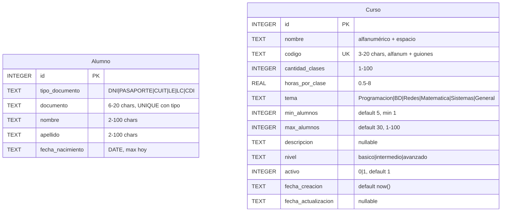

# Repaso

* SQL (con SQLite)
  * DBBrowser
  * Crear tablas
    * Contraints
      * CHECK
        * GLOB (Expresiones Regulares)
      * UNIQUE
      * NOT NULL
    * Uso de IA y Reglas
      * Estudiar las reglas para que los registros sean consistentes
      * Utilizar la IA para analizar la tabla creada y que tenga todos los constraints
      * Claude me hacia preguntas de una (Patron interaccion)
  * Creamos Tablas
    * Alumno
    * Curso
* SQL
  * Select
  * DML
    * INSERT
    * UPATE
  * DDL
    * ALTER TABLE
    * DROP

# Base de Datos

## Reconstruyendo la base

* Tabla Alumno
  
```
CREATE TABLE Alumno (
    id               INTEGER PRIMARY KEY AUTOINCREMENT,
    tipo_documento   TEXT    NOT NULL,
    documento        TEXT    NOT NULL,
    nombre           TEXT    NOT NULL,
    apellido         TEXT    NOT NULL,
    fecha_nacimiento TEXT    NOT NULL,

    CONSTRAINT ck_tipo_documento CHECK (
        tipo_documento IN ('DNI', 'PASAPORTE', 'CUIT', 'LE', 'LC', 'CDI')
    ),
    CONSTRAINT ck_documento CHECK (
        LENGTH(TRIM(documento)) BETWEEN 6 AND 20
    ),
    CONSTRAINT ck_nombre CHECK (
        LENGTH(TRIM(nombre)) BETWEEN 2 AND 100
    ),
    CONSTRAINT ck_apellido CHECK (
        LENGTH(TRIM(apellido)) BETWEEN 2 AND 100
    ),
   CONSTRAINT ck_fecha_nacimiento CHECK (
       fecha_nacimiento GLOB '[0-9][0-9][0-9][0-9]-[0-9][0-9]-[0-9][0-9]'
       AND SUBSTR(fecha_nacimiento, 1, 4) BETWEEN '1900' AND '2100'
       AND SUBSTR(fecha_nacimiento, 6, 2) BETWEEN '01' AND '12'
       AND SUBSTR(fecha_nacimiento, 9, 2) BETWEEN '01' AND '31'
   )
    CONSTRAINT uq_tipo_documento UNIQUE (tipo_documento, documento)
);
```

> [!NOTE]
> Tuve que corregir la tabla alumno porque no puedo usar la funcion DATE('now') en la creacion
> Tuve que cabiar esto


```
     CONSTRAINT ck_fecha_nacimiento CHECK (
        DATE(fecha_nacimiento) IS NOT NULL
        AND DATE(fecha_nacimiento) = fecha_nacimiento
        AND fecha_nacimiento <= DATE('now')
        AND SUBSTR(fecha_nacimiento, 1, 4) BETWEEN '1900' AND '2100'
    ),
```

* Curso

```
CREATE TABLE Curso (
    id          INTEGER     NOT NULL
                            CONSTRAINT pk_curso PRIMARY KEY AUTOINCREMENT,

    nombre      TEXT        NOT NULL
                            CONSTRAINT ck_nombre_no_vacio  CHECK (LENGTH(TRIM(nombre)) > 0)
                            CONSTRAINT ck_nombre_formato   CHECK (nombre GLOB '[A-Za-z0-9 ]*'),

    codigo      TEXT        NOT NULL
                            CONSTRAINT uq_codigo           UNIQUE
                            CONSTRAINT ck_codigo_longitud  CHECK (LENGTH(TRIM(codigo)) BETWEEN 3 AND 20)
                            CONSTRAINT ck_codigo_formato   CHECK (codigo GLOB '[A-Za-z0-9-_]*'),

    cantidad_clases INTEGER NOT NULL
                            CONSTRAINT ck_cantidad_clases  CHECK (cantidad_clases BETWEEN 1 AND 100),

    horas_por_clase REAL    NOT NULL
                            CONSTRAINT ck_horas_por_clase  CHECK (horas_por_clase BETWEEN 0.5 AND 8),

    tema        TEXT        NOT NULL
                            CONSTRAINT ck_tema_no_vacio    CHECK (LENGTH(TRIM(tema)) > 0)
                            CONSTRAINT ck_tema_enum        CHECK (tema IN ('Programacion', 'Base de Datos', 'Redes', 'Matematica', 'Sistemas', 'General')),

    min_alumnos INTEGER     NOT NULL DEFAULT 5
                            CONSTRAINT ck_min_alumnos      CHECK (min_alumnos >= 1),

    max_alumnos INTEGER     NOT NULL DEFAULT 30
                            CONSTRAINT ck_max_alumnos      CHECK (max_alumnos BETWEEN 1 AND 100),

    descripcion TEXT,

    nivel       TEXT        NOT NULL DEFAULT 'basico'
                            CONSTRAINT ck_nivel            CHECK (nivel IN ('basico', 'intermedio', 'avanzado')),

    activo      INTEGER     NOT NULL DEFAULT 1
                            CONSTRAINT ck_activo           CHECK (activo IN (0, 1)),

    fecha_creacion      TEXT NOT NULL DEFAULT (datetime('now')),
    fecha_actualizacion TEXT,

    CONSTRAINT ck_rango_alumnos CHECK (min_alumnos <= max_alumnos)
```

* DER



* Agregar Datos

* Quiero el insert para 3 alumnos y 3 cursos

```
```

## Herramientas de IA

## Claves Foraneas


# Expresiones Regulares
