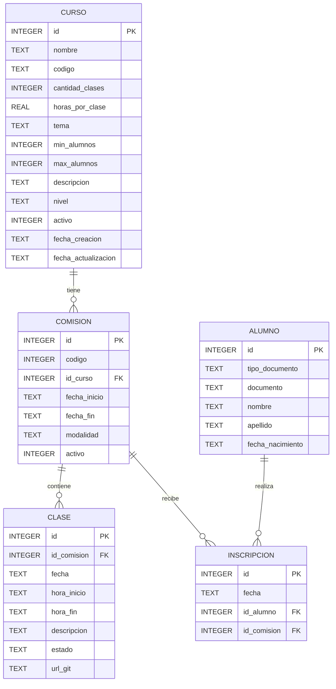

# Clase 19 - 13 de Mayo del 2026

# Repaso

* Base de Datos
  * Consultas
      * Subquerys o sub consultas
  * Relaciones entre Tablas
    * 1 a 1
    * 1 a N
    * Foreign Key (Clave Foranea)
      * Apunta ala Primary Key
  * Representacion Visual Base de Datos
    * DER
      * En Mermaid
  * Transacciones en Bases de Datos
      * Start Transaction
      * Commit
      * Rollback
  * Diseño de Bases de Datos  << Mucho muy importante
      * Consistencia
          * A nivel registro
          * A niver varias tablas
      * Normalizacion
        * Evitar redundancia
 
# Herramientas de IA para base de datos

Lo que hicimos la clase pasada

```
Un sistema que registra los alumnos de una comision educativa y los cursos que se pueden dictar. Cuando se decide dictar un curso se abre una comision
y cada comision tiene una serie de clases con su duracion y dia de cursada.
Por ahora solo eso.
```

## Database Build

> https://database.build/

 * UN llm convencional
     * Infiere la estructura de la base de datos a partir del contexto
     * No hay base de datos real de lado del LLM
* Database.build
    * Genera una base de dats postgres SQL
    * Posee una herramienta para que un LLM interacture con la base de datos

* Me creo este esquema


* LE vamos a pedir que agregue registros de ejemplos en todas las tablas

```
Agregarme registros de ejemplo en todas las tablas
```

* Generar consultas en SQL

```
select * from student
```

* Generar consultas SQL a partir de lenguaje natural

```
Queiro el query para darme una lista de alumnos que no esten inscriptos en ninguna comision
```

* Me devuelve el siguiente Query

```
SELECT s.id, s.name, s.email
FROM students s
LEFT JOIN student_commissions sc ON s.id = sc.student_id
WHERE sc.commission_id IS NULL;
```
* O bien

```
SELECT id, name, email
FROM students
WHERE id NOT IN (
    SELECT student_id
    FROM student_commissions
);
```

* Se animan a probar la herramienta

> Puntaje : 10 / 10

## Supabase

* Es un "database hosting" que permite tener una base de datos en internet.
  * Gratuita con limitacions o pagar si necesitamos mas espacio o capacidad de computo

## Pendiente

> [!NOTE]
> Luego vamos a migrar nuestra base de SQLite a Postgres SQL

---

# Expresiones regulares

* Es una cadena de caracteres que tiene cierta sintaxis compacta que me determina si un un string cumple con cierto formato
* Tiene ciertos caractes especiales
    * ^ : Matchea con el inicio del string
      * ^Ho : Matchea si el string comienza con "Ho"
   * $ : Mache con el final del string
     * al$ : Marche si el string termina en "al"
   * . : Cualquier caracter
       * ....  son hasta 4 caracteres
   * [A-Z] : Caracteres posibles (A-Z) mayucula
   * .* : Cualquier caracter (.) n veces (*)

* ^[Hh]o.*al$
    * ^ Empieza con
    * [Hh] la letra H o h (mayuscula y muniscula
    * o despues una o
    * . despues cualquier caracter
    * N veces (*)
    * Termina con al (al$)


> https://regex101.com/

* Hoy en dia las podemos armar con la IA

```
Dame una regex para validar un numero de telefono 5555-55555 (cuatro digitos, guion , cuatro digitos). Tiene que tener exactamente 8 numeros y un guion en el medio
```

* Me devuelve

```
^\d{4}-\d{4}$
```

## Bases de datos con expresiones regulares

* Quiero una tabla PErsona (id, nombre, Celular)
  * El nombre Empieza con mayuscula y despues todos caracteres en minuscula sin espacio
  * El celilar empieza con 11 (4 digitos) - (4 dititos)

* Sqlite
```
CREATE TABLE Persona (
    id INTEGER NOT NULL PRIMARY KEY AUTOINCREMENT,

    nombre TEXT NOT NULL
        CHECK (
            nombre REGEXP '^[A-Z][a-z]+$'
        ),

    celular TEXT NOT NULL
        CHECK (
            celular REGEXP '^11[0-9]{2}-[0-9]{4}$'
        )
);
```

* o Bien (Sin expresiones regulares)

```
CREATE TABLE IF NOT EXISTS Persona (
    id      INTEGER PRIMARY KEY AUTOINCREMENT,
    nombre  TEXT    NOT NULL
                    CHECK (
                        -- Sin espacios
                        nombre NOT LIKE '% %'
                        -- 1ra letra mayúscula (A–Z)
                        AND substr(nombre, 1, 1) BETWEEN 'A' AND 'Z'
                        -- Resto en minúscula (a–z)
                        AND lower(substr(nombre, 2)) = substr(nombre, 2)
                    ),
    celular TEXT    NOT NULL
                    CHECK (
                        -- Empieza con 11, formato: 1123-4567
                        celular GLOB '11[0-9][0-9]-[0-9][0-9][0-9][0-9]'
                    )
);
```

* En postgres

```
CREATE TABLE Persona (
    id SERIAL PRIMARY KEY,

    nombre TEXT NOT NULL
        CHECK (
            nombre ~ '^[A-Z][a-z]+$'
        ),

    celular TEXT NOT NULL
        CHECK (
            celular ~ '^11[0-9]{2}-[0-9]{4}$'
        )
);
```

---

# Base de datos

* El Script de la base de datos que teniamos
  
```sql
CREATE TABLE Alumno (
    id               INTEGER PRIMARY KEY AUTOINCREMENT,
    tipo_documento   TEXT    NOT NULL,
    documento        TEXT    NOT NULL,
    nombre           TEXT    NOT NULL,
    apellido         TEXT    NOT NULL,
    fecha_nacimiento TEXT    NOT NULL,

    CONSTRAINT ck_tipo_documento CHECK (
        tipo_documento IN ('DNI', 'PASAPORTE', 'CUIT', 'LE', 'LC', 'CDI')
    ),
    CONSTRAINT ck_documento CHECK (
        LENGTH(TRIM(documento)) BETWEEN 6 AND 20
    ),
    CONSTRAINT ck_nombre CHECK (
        LENGTH(TRIM(nombre)) BETWEEN 2 AND 100
    ),
    CONSTRAINT ck_apellido CHECK (
        LENGTH(TRIM(apellido)) BETWEEN 2 AND 100
    ),
   CONSTRAINT ck_fecha_nacimiento CHECK (
       fecha_nacimiento GLOB '[0-9][0-9][0-9][0-9]-[0-9][0-9]-[0-9][0-9]'
       AND SUBSTR(fecha_nacimiento, 1, 4) BETWEEN '1900' AND '2100'
       AND SUBSTR(fecha_nacimiento, 6, 2) BETWEEN '01' AND '12'
       AND SUBSTR(fecha_nacimiento, 9, 2) BETWEEN '01' AND '31'
   )
    CONSTRAINT uq_tipo_documento UNIQUE (tipo_documento, documento)
);

CREATE TABLE Curso (
    id          INTEGER     NOT NULL
                            CONSTRAINT pk_curso PRIMARY KEY AUTOINCREMENT,

    nombre      TEXT        NOT NULL
                            CONSTRAINT ck_nombre_no_vacio  CHECK (LENGTH(TRIM(nombre)) > 0)
                            CONSTRAINT ck_nombre_formato   CHECK (nombre GLOB '[A-Za-z0-9 ]*'),

    codigo      TEXT        NOT NULL
                            CONSTRAINT uq_codigo           UNIQUE
                            CONSTRAINT ck_codigo_longitud  CHECK (LENGTH(TRIM(codigo)) BETWEEN 3 AND 20)
                            CONSTRAINT ck_codigo_formato   CHECK (codigo GLOB '[A-Za-z0-9-_]*'),

    cantidad_clases INTEGER NOT NULL
                            CONSTRAINT ck_cantidad_clases  CHECK (cantidad_clases BETWEEN 1 AND 100),

    horas_por_clase REAL    NOT NULL
                            CONSTRAINT ck_horas_por_clase  CHECK (horas_por_clase BETWEEN 0.5 AND 8),

    tema        TEXT        NOT NULL
                            CONSTRAINT ck_tema_no_vacio    CHECK (LENGTH(TRIM(tema)) > 0)
                            CONSTRAINT ck_tema_enum        CHECK (tema IN ('Programacion', 'Base de Datos', 'Redes', 'Matematica', 'Sistemas', 'General')),

    min_alumnos INTEGER     NOT NULL DEFAULT 5
                            CONSTRAINT ck_min_alumnos      CHECK (min_alumnos >= 1),

    max_alumnos INTEGER     NOT NULL DEFAULT 30
                            CONSTRAINT ck_max_alumnos      CHECK (max_alumnos BETWEEN 1 AND 100),

    descripcion TEXT,

    nivel       TEXT        NOT NULL DEFAULT 'basico'
                            CONSTRAINT ck_nivel            CHECK (nivel IN ('basico', 'intermedio', 'avanzado')),

    activo      INTEGER     NOT NULL DEFAULT 1
                            CONSTRAINT ck_activo           CHECK (activo IN (0, 1)),

    fecha_creacion      TEXT NOT NULL DEFAULT (datetime('now')),
    fecha_actualizacion TEXT,

    CONSTRAINT ck_rango_alumnos CHECK (min_alumnos <= max_alumnos)
);


CREATE TABLE Comision (
    id           INTEGER NOT NULL CONSTRAINT pk_comision PRIMARY KEY AUTOINCREMENT,
    codigo       INTEGER NOT NULL CONSTRAINT uq_codigo UNIQUE,
    id_curso     INTEGER NOT NULL CONSTRAINT fk_curso REFERENCES Curso(id),
    fecha_inicio TEXT    NOT NULL CONSTRAINT ck_fecha_inicio CHECK (
                             DATE(fecha_inicio) IS NOT NULL
                             AND DATE(fecha_inicio) = fecha_inicio
                         ),
    fecha_fin    TEXT    NOT NULL CONSTRAINT ck_fecha_fin CHECK (
                             DATE(fecha_fin) IS NOT NULL
                             AND DATE(fecha_fin) = fecha_fin
                             AND fecha_fin >= fecha_inicio
                         ),
    modalidad    TEXT    NOT NULL CONSTRAINT ck_modalidad CHECK (
                             modalidad IN ('Presencial', 'Virtual', 'Asincronico', 'Hibrida')
                         ),
    activo       INTEGER NOT NULL DEFAULT 1
                         CONSTRAINT ck_activo CHECK (activo IN (0, 1))
);

CREATE TABLE Clase (
    id           INTEGER NOT NULL CONSTRAINT pk_clase PRIMARY KEY AUTOINCREMENT,
    id_comision  INTEGER NOT NULL CONSTRAINT fk_comision REFERENCES Comision(id),
    fecha        TEXT    NOT NULL CONSTRAINT ck_fecha CHECK (
                             DATE(fecha) IS NOT NULL
                             AND DATE(fecha) = fecha
                         ),
    hora_inicio  TEXT    NOT NULL CONSTRAINT ck_hora_inicio CHECK (
                             hora_inicio GLOB '[0-2][0-9]:[0-5][0-9]'
                         ),
    hora_fin     TEXT    NOT NULL CONSTRAINT ck_hora_fin CHECK (
                             hora_fin GLOB '[0-2][0-9]:[0-5][0-9]'
                             AND hora_fin > hora_inicio
                         ),
    descripcion  TEXT    NOT NULL DEFAULT '',
    estado       TEXT    NOT NULL DEFAULT 'pendiente'
                         CONSTRAINT ck_estado CHECK (
                             estado IN ('pendiente', 'dictada', 'cancelada')
                         ),
    url_git      TEXT    NOT NULL DEFAULT ''
);
```

* Algunos datos de prueba (Generados por IA)

```
PRAGMA foreign_keys = ON;

------------------------------------------------------------
-- ALUMNOS
------------------------------------------------------------
INSERT INTO Alumno (tipo_documento, documento, nombre, apellido, fecha_nacimiento) VALUES
('DNI', '30123456', 'Juan', 'Perez', '1995-04-12'),
('DNI', '28987654', 'Maria', 'Gomez', '1992-11-03'),
('PASAPORTE', 'AA123456', 'John', 'Smith', '1988-07-21'),
('CUIT', '20-34567890-1', 'Lucia', 'Fernandez', '1999-01-15'),
('DNI', '40111222', 'Carlos', 'Lopez', '2001-09-30'),
('LE', '1234567', 'Ana', 'Martinez', '1985-05-10');

------------------------------------------------------------
-- CURSOS
------------------------------------------------------------
INSERT INTO Curso (
    nombre, codigo, cantidad_clases, horas_por_clase,
    tema, min_alumnos, max_alumnos, descripcion, nivel
) VALUES
('Programacion Inicial', 'PROG-101', 12, 2, 'Programacion', 5, 30, 'Introduccion a la programacion', 'basico'),
('Base de Datos I', 'BD-201', 10, 2.5, 'Base de Datos', 5, 25, 'Modelado y SQL', 'basico'),
('Redes Computadoras', 'NET-150', 8, 3, 'Redes', 5, 20, 'Conceptos de redes', 'intermedio'),
('Matematica Discreta', 'MAT-110', 14, 2, 'Matematica', 5, 35, 'Logica y conjuntos', 'basico'),
('Sistemas Operativos', 'SO-220', 10, 3, 'Sistemas', 5, 30, 'Procesos y memoria', 'intermedio');

------------------------------------------------------------
-- COMISIONES
------------------------------------------------------------
INSERT INTO Comision (codigo, id_curso, fecha_inicio, fecha_fin, modalidad, activo) VALUES
(1001, 1, '2026-03-01', '2026-06-30', 'Virtual', 1),
(1002, 2, '2026-03-10', '2026-07-15', 'Presencial', 1),
(1003, 3, '2026-04-01', '2026-07-01', 'Hibrida', 1),
(1004, 4, '2026-03-05', '2026-06-20', 'Asincronico', 1),
(1005, 5, '2026-04-15', '2026-08-01', 'Virtual', 1);

------------------------------------------------------------
-- CLASES
------------------------------------------------------------
INSERT INTO Clase (
    id_comision, fecha, hora_inicio, hora_fin, descripcion, estado, url_git
) VALUES
(1, '2026-03-02', '18:00', '20:00', 'Introduccion a variables', 'dictada', 'https://github.com/curso/prog1'),
(1, '2026-03-09', '18:00', '20:00', 'Condicionales', 'dictada', 'https://github.com/curso/prog1'),
(1, '2026-03-16', '18:00', '20:00', 'Bucles', 'pendiente', ''),

(2, '2026-03-11', '19:00', '21:30', 'Modelado ER', 'dictada', 'https://github.com/curso/bd1'),
(2, '2026-03-18', '19:00', '21:30', 'SQL Basico', 'pendiente', ''),

(3, '2026-04-02', '17:00', '20:00', 'OSI y TCP/IP', 'dictada', 'https://github.com/curso/redes'),
(3, '2026-04-09', '17:00', '20:00', 'Direccionamiento IP', 'pendiente', ''),

(4, '2026-03-06', '16:00', '18:00', 'Logica proposicional', 'dictada', 'https://github.com/curso/matdiscreta'),

(5, '2026-04-16', '20:00', '23:00', 'Procesos', 'pendiente', '');
```

## Integridad Referencial

* Las FK tienen que referenciar a ID existentes


## Vamos a agregar la tabla Inscripcion

* Campos
  * Fecha
  * Id_Alumno
  * Id_Comision
* Restricciones
  * El alumno no se puede inscribir dos veces en la misma comision
  * Cuando borro al alumno se deben eliminar automaticamente todas las inscripciones << Para este escenario

> CTAL Me arman ustedes la tabla? Se animan

```sql
CREATE TABLE Inscripcion (
    id           INTEGER NOT NULL PRIMARY KEY AUTOINCREMENT,
    fecha        TEXT    NOT NULL CHECK (
                             DATE(fecha) IS NOT NULL
                             AND DATE(fecha) = fecha
                         ),
    id_alumno    INTEGER NOT NULL REFERENCES Alumno(id) ON DELETE CASCADE,
    id_comision  INTEGER NOT NULL REFERENCES Comision(id),
    CONSTRAINT uq_alumno_comision UNIQUE (id_alumno, id_comision)
);
```

## DER



## Manejo de funciones

* Cada motor de base de datos tiene sus funciones usar en los select
  * SQLITE
  * Ejemplo
    * Funcion DATE
    * Coalesce
      * Devuelve el primer valor no nulo
      * Por ejemplo para traer el primero que no sea nulo
      * Convertir el valor nulo en un valor por defecto en una consulta
    * TYPE
    * Strings
      * Upper
      * Length
      * Trim
      * Char
  * Documentacion
    * https://sqlite.org/docs.html
   
```
select date("now")
```

```
select upper("hola")
```

* CTA : 3 Ejemplos mas como los anteriores (ej para el manejo de strings) con funciones de SQLite <<< Me los pasan uds??

```
select trim("    hola    ")

select length(trim("    hola    "))
```

 * La funcion Char convierte un codigo unicode en un caracter
```
SELECT CHAR(65) as A, CHAR(241) as Enie, CHAR(8364) as Euro;
```

```
SELECT COALESCE(NULL, NULL, 'fallback', 'otro');
```

```
SELECT TYPEOF(123), TYPEOF('hola'), TYPEOF(NULL), TYPEOF(3.14);
```
