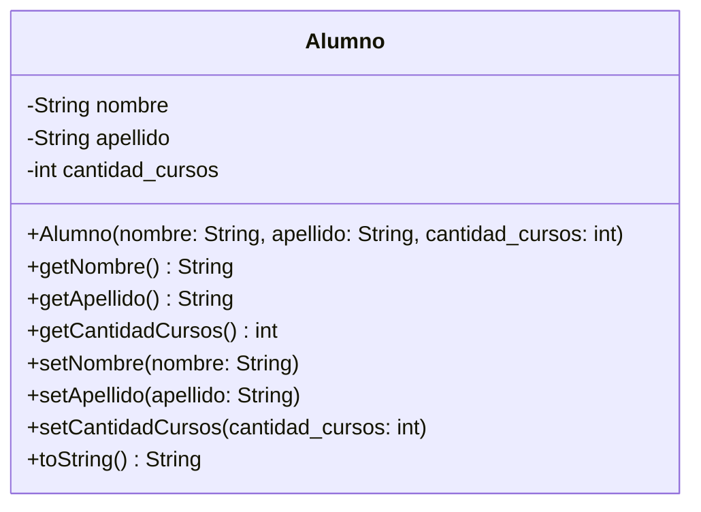

# Clase Once - 10 de Abril del 2026

# Repaso

* Proceso de Desarrollo
  * Evolucion Historica
  * El Perfil del desarrollador del Futuro
      * Optimizar la calidad del codigo
          * Clean Code
              * https://www.amazon.com/s?k=clean+code+by+robert+c+martin&language=es_US
              * Los mandamiento de La programacion
                  * No Hardcodear Valores  <<<
      * Enfocado en System Desgin
* Proyecto Integrador
  * Modificamos el Cursos
  * Agregamos una clase alumno
  * Python
      * Los metodos que tienen __ (doble guion bajo) antes y despues son metodos "especiales" que se llaman "metodos magicos" o "metodos dunder"
  * Deuda Cognitiva
      * Constructores
      * Self
      * @classmethod @staticmethod   << Metodos de Clase y Metodos de Instancia
      * Setters, Gettters, Encapsulamiento


# Frase Destacadas de la clase

* "El futuro es saber un poco de todo"
    * Maria Jose dixit
* "Sii obvio , tmb eso da a pie que con la ia salgan nuevos lenguajes mas eficientes"
    * Julian Muñoz
    
# Plan para la clase de Hoy

* Hablar un poco de lenguajes de programacion
* Hablar de la POO
* Ver la deuda cognitiva

# Colab de la clase

# Progracion Orientada a Objetos

## Lenguajes de Programacion

* La POO es general y no esta asociada a un lenguaje de programacion especifico
* Si vemos ejemplos de los conceptos del POO implementados en distintoas lenguaje nos ayuda a pensar mas a alla de python o el lenguaje concreto
* Yo voy a usar la IA para hacer un proyecto puede ser bueno elegir el lenguaje de programacion Adecuado para el proyecto en cuestion

* Python
```
class Alumno:
    #Constuctor
    def __init__(self, nombre, apellido, cantidad_cursos):
        self.nombre = nombre
        self.apellido = apellido
        self.cantidad_cursos = cantidad_cursos
    
    def __str__(self):
        return f"{self.nombre} {self.apellido} - {self.cantidad_cursos} cursos"

# Ejemplo de uso
alumno1 = Alumno("Juan", "Pérez", 3)
```

* Java
```
public class Alumno {
    private String nombre;
    private String apellido;
    private int cantidadCursos;
    
    // Constructor
    public Alumno(String nombre, String apellido, int cantidadCursos) {
        this.nombre = nombre;
        this.apellido = apellido;
        this.cantidadCursos = cantidadCursos;
    }
    
    // Getters
    public String getNombre() {
        return nombre;
    }
    
    public String getApellido() {
        return apellido;
    }
    
    public int getCantidadCursos() {
        return cantidadCursos;
    }
    
    // Setters
    public void setNombre(String nombre) {
        this.nombre = nombre;
    }
    
    public void setApellido(String apellido) {
        this.apellido = apellido;
    }
    
    public void setCantidadCursos(int cantidadCursos) {
        this.cantidadCursos = cantidadCursos;
    }
    
    // toString
    @Override
    public String toString() {
        return nombre + " " + apellido + " - " + cantidadCursos + " cursos";
    }
}

//Ejemplo de Uso
Alumno alumno1 = new Alumno("Juan", "Pérez", 3);
```

* Javascript (ES-6) Mas moderna

```jascript
class Alumno {
    constructor(nombre, apellido, cantidadCursos) {
        this.nombre = nombre;
        this.apellido = apellido;
        this.cantidadCursos = cantidadCursos;
    }
    
    // Getters
    getNombre() {
        return this.nombre;
    }
    
    getApellido() {
        return this.apellido;
    }
    
    getCantidadCursos() {
        return this.cantidadCursos;
    }
    
    // Setters
    setNombre(nombre) {
        this.nombre = nombre;
    }
    
    setApellido(apellido) {
        this.apellido = apellido;
    }
    
    setCantidadCursos(cantidadCursos) {
        this.cantidadCursos = cantidadCursos;
    }
    
    // toString
    toString() {
        return `${this.nombre} ${this.apellido} - ${this.cantidadCursos} cursos`;
    }
}

// Uso
const alumno1 = new Alumno("Juan", "Pérez", 3);
const alumno2 = new Alumno("María", "García", 5);

console.log(alumno1.toString());
console.log(alumno2.toString());
```

* Javascript (Old-School)

```javascript
function Alumno(nombre, apellido, cantidadCursos) {
    this.nombre = nombre;
    this.apellido = apellido;
    this.cantidadCursos = cantidadCursos;
}

// Métodos en el prototipo
Alumno.prototype.getNombre = function() {
    return this.nombre;
};

Alumno.prototype.getApellido = function() {
    return this.apellido;
};

Alumno.prototype.getCantidadCursos = function() {
    return this.cantidadCursos;
};

Alumno.prototype.setNombre = function(nombre) {
    this.nombre = nombre;
};

Alumno.prototype.setApellido = function(apellido) {
    this.apellido = apellido;
};

Alumno.prototype.setCantidadCursos = function(cantidadCursos) {
    this.cantidadCursos = cantidadCursos;
};

Alumno.prototype.toString = function() {
    return `${this.nombre} ${this.apellido} - ${this.cantidadCursos} cursos`;
};

// Uso
const alumno1 = new Alumno("Juan", "Pérez", 3);
const alumno2 = new Alumno("María", "García", 5);

console.log(alumno1.toString());
console.log(alumno2.toString());
```

* En Rust
```
pub struct Alumno {
    nombre: String,
    apellido: String,
    cantidad_cursos: u32,
}

impl Alumno {
    // Constructor
    pub fn new(nombre: String, apellido: String, cantidad_cursos: u32) -> Self {
        Alumno {
            nombre,
            apellido,
            cantidad_cursos,
        }
    }
    
    // Getters
    pub fn get_nombre(&self) -> &str {
        &self.nombre
    }
    
    pub fn get_apellido(&self) -> &str {
        &self.apellido
    }
    
    pub fn get_cantidad_cursos(&self) -> u32 {
        self.cantidad_cursos
    }
    
    // Setters
    pub fn set_nombre(&mut self, nombre: String) {
        self.nombre = nombre;
    }
    
    pub fn set_apellido(&mut self, apellido: String) {
        self.apellido = apellido;
    }
    
    pub fn set_cantidad_cursos(&mut self, cantidad_cursos: u32) {
        self.cantidad_cursos = cantidad_cursos;
    }
    
    // Método display
    pub fn mostrar(&self) -> String {
        format!("{} {} - {} cursos", self.nombre, self.apellido, self.cantidad_cursos)
    }
}

// Implementar Display para println!
impl std::fmt::Display for Alumno {
    fn fmt(&self, f: &mut std::fmt::Formatter) -> std::fmt::Result {
        write!(f, "{} {} - {} cursos", self.nombre, self.apellido, self.cantidad_cursos)
    }
}
```

* UML (Unfified Modeling Language)
 * Me permite hacer el dibujo del sistema como si fuera el plano de la casa sin programarlo
   



* Diferencias
  * En python el constructor declara los atributos
  * En otos lenguajes los atriburos los puedo declarar aparte y puedo tener constructores vacios
  * En JAVA (y en los otros lenguajes) se ve que hay setters y getters (y que corno es esto) y en Python no  <<<<<
  * El constructor se escribe distinto segun el lenguaje (Todos tienen constructor pero cambia la forma __init___, Alumno, construnctor)

* Antes
  * Sistemas ENORMES
* Ahora
   * Sistemas Mas chicos que se comunicas

* Observaciones
   * Python no es la mejor opcion para aprender POO. Se puede pero los que hicieron el lenguaje priorizaron otras cosas : facilida de lectura, menos codigo, 
      * Admite programar sin objetos con programacion estructurada
      * Pithon tiene un ecosistema de librerias GIGANTE.
      * Cada vez que haces algo no hay que reinventar la rueda
      * MAs facil para sistemas Chicos
   * C# y Java son lenguajes fuertemente tipados que llevaban la POO como bandera, era algo fundamental de como se concibio
      * Te obligan a programar en objetos
      * Ideales para sistemas GRANDES, son mas seguros, 

## Programacion Orientada a Objetos

* Hay dos Enfonques
   * Clasico : Una sintaxis para aprender a programar de una forma determinada
   * System Design : Una forma de pensar y organizar un sistema para que sea facil de mantener y entender
       * Donde nosotros como personas hoy en dia aportamos el CRITERIO

### Conceptos

* Consistencia : Cuano tengo un conjunto de datos relacionados, los datos son consistentes cuando tienen sentido en el contexto que plante
  * Alumno (nombre="Juan", apellido="Perez", cantidad_cursos=3)         <<< Alumno consistente
  * Alumno (nombre="", apellido="Perez", cantidad_cursos=3)             <<< Alumno Inconsistente
  * Alumno (nombre="@4334$#@#$", apellido="Perez", cantidad_cursos=3)   <<< Alumno Inconsistente
  * La consistencia muchas veces me la define las reglas de negocio, el contexto

* Contructor : El inicializados de un objeto. Cuando creas un objeto se ejecuta si o si este metodo y adentro hay un molde como quiero que sean los objetos del mismo tipo (clase) al principio. Al momento de crear el objeto con el constructor se pide memoria en un lugar de la memoria que generalmente se llama HEAP.
     * Buena Practira : Asegurar que el objeto que se cree sea consistente

* Objeto : Tiene un conjunto de atributos que en un momento dato tienen un valor especifico (muchas variables declaradas en una sola)
     * Buena practica : Es deseable asegurar que los atributos de un objeto sean consistentes todo el tiempo

* Encapsulamiento
   * Formal : Es separar la representacion interna del objeto de los mecanismos para interactuar con ella
   * Santiago : Es guardar los datos y como funcionan dentro del objeto para que desde afuera solo puedas usarlo sin romper lo que hay por dentro
   * Proteger los atributos de un objeto para que no los puedan manosar desde afuera y dejarnos el objeto inconsistnte

* Ejemplo
 * Con encapsulamiento
   
 * Sin Encapsulamiento
   

> [!NOTE]
> La primera version que nos hizo python de la clase Alumno es como tener un auto que para prenderlo tenemos que hacer corto con los bables y no hay llave

> [!NOTE]
> Voy a una casa, el tablero tiene todos los cables al aire pelado, le llueve, hace chispas

## Ejemplo

* Tengo este codigo (Parcialmente generado con la IA)
```
class Alumno:
    #Constuctor
    def __init__(self, nombre, apellido, cantidad_cursos):
        self.nombre = nombre
        self.apellido = apellido
        self.cantidad_cursos = cantidad_cursos
    
    def __str__(self):
        return f"{self.nombre} {self.apellido} - {self.cantidad_cursos} cursos"

# Observacion 1: Veo que el sistema permite crear objetos inconsistentes
pedro = Alumno("Pedro","",-1)
print(pedro)

# Observacion 2 : Tengo un objeto consistente, modifico desde afuera sus atributos y lo vuelvo inconsitent
juan = Alumno("Juan","Perez",1)
juan.nombre = "";
print(juan)
```

* Obsercaciones
  * El sistema me pemite crear objetos inconsistntes

```python
class Alumno:
    def __init__(self, nombre, apellido, cantidad_cursos):
        # Validaciones
        if not isinstance(nombre, str) or not nombre.strip():
            raise ValueError("El nombre debe ser un string no vacío")
        if not isinstance(apellido, str) or not apellido.strip():
            raise ValueError("El apellido debe ser un string no vacío")
        if not isinstance(cantidad_cursos, int) or cantidad_cursos < 0:
            raise ValueError("cantidad_cursos debe ser un entero no negativo")
        
        self.nombre = nombre.strip()
        self.apellido = apellido.strip()
        self.cantidad_cursos = cantidad_cursos
    
    def __str__(self):
        return f"{self.nombre} {self.apellido} - {self.cantidad_cursos} cursos"
    
```

* Obsercaciones
  * El sistema me pemite crear objetos consistentes pero despues cambiarles un atributo y volverlos incosistentes
  * Por este problema se inventaron lo setters, que son metodos especiales que llamo cuando quiero cargar un atributo
  * Por eso Claude hizo este codigo
  * En python como practica dudosa muchas veces omiten los setters pero lenguajes como java te obligan a tenerlo
 

```python
class Alumno:
    def __init__(self, nombre, apellido, cantidad_cursos):
        # Validaciones
        if not isinstance(nombre, str) or not nombre.strip():
            raise ValueError("El nombre debe ser un string no vacío")
        if not isinstance(apellido, str) or not apellido.strip():
            raise ValueError("El apellido debe ser un string no vacío")
        if not isinstance(cantidad_cursos, int) or cantidad_cursos < 0:
            raise ValueError("cantidad_cursos debe ser un entero no negativo")
        
        self.nombre = nombre.strip()
        self.apellido = apellido.strip()
        self.cantidad_cursos = cantidad_cursos
    
    def __str__(self):
        return f"{self.nombre} {self.apellido} - {self.cantidad_cursos} cursos"
    
    # Setter con validación
    def set_nombre(self, nombre):
        if not isinstance(nombre, str) or not nombre.strip():
            raise ValueError("El nombre debe ser un string no vacío")
        self.nombre = nombre.strip()


# Crear alumno válido
juan = Alumno("Juan", "Pérez", 3)
print(f"Original: {juan}")
print(f"Nombre actual: {juan.nombre}")

# Cambiar nombre correctamente (VÁLIDO)
juan.set_nombre("Juanito")
print(f"\nDespués del cambio: {juan}")
print(f"Nombre nuevo: {juan.nombre}")

# Intentar cambiar con un valor inválido (FALLA)
try:
    juan.set_nombre("")  # Intenta poner vacío
except ValueError as e:
    print(f"\nError al cambiar: {e}")
    print(f"El nombre se mantiene: {juan.nombre}")  # Sigue siendo "Juanito"

# Otro intento inválido
try:
    juan.set_nombre(123)  # Intenta pasar un número
except (ValueError, AttributeError) as e:
    print(f"\nError al cambiar: {e}")
    print(f"El nombre se mantiene: {juan.nombre}")  # Sigue siendo "Juanito"
```

* Por esto python no es tan bueno para programar en objetos
 * A pesar de que tengo el Setter me deja hacer esto
 * Al divino boton el setter

```python
alu = Alumno("Juan", "Perez", 1)
alu.nombre = ""
print(alu)
```

* Le pedimos que lo mejore
* Se lo planteo a Claude y me hace este codigo

```
class Alumno:
    def __init__(self, nombre, apellido, cantidad_cursos):
        # Validaciones
        if not isinstance(nombre, str) or not nombre.strip():
            raise ValueError("El nombre debe ser un string no vacío")
        if not isinstance(apellido, str) or not apellido.strip():
            raise ValueError("El apellido debe ser un string no vacío")
        if not isinstance(cantidad_cursos, int) or cantidad_cursos < 0:
            raise ValueError("cantidad_cursos debe ser un entero no negativo")
        
        self._nombre = nombre.strip()
        self._apellido = apellido.strip()
        self._cantidad_cursos = cantidad_cursos
    
    # PROPERTY para nombre - obliga a pasar por validación
    @property
    def nombre(self):
        return self._nombre
    
    @nombre.setter
    def nombre(self, valor):
        if not isinstance(valor, str) or not valor.strip():
            raise ValueError("El nombre debe ser un string no vacío")
        self._nombre = valor.strip()
    
    # PROPERTY para apellido
    @property
    def apellido(self):
        return self._apellido
    
    @apellido.setter
    def apellido(self, valor):
        if not isinstance(valor, str) or not valor.strip():
            raise ValueError("El apellido debe ser un string no vacío")
        self._apellido = valor.strip()
    
    # PROPERTY para cantidad_cursos
    @property
    def cantidad_cursos(self):
        return self._cantidad_cursos
    
    @cantidad_cursos.setter
    def cantidad_cursos(self, valor):
        if not isinstance(valor, int) or valor < 0:
            raise ValueError("cantidad_cursos debe ser un entero no negativo")
        self._cantidad_cursos = valor
    
    def __str__(self):
        return f"{self._nombre} {self._apellido} - {self._cantidad_cursos} cursos"


# Ahora SÍ funciona como debe ser
alu = Alumno("Juan", "Pérez", 1)
print(f"Original: {alu}")

# Intento cambiar directamente (AHORA FALLA)
try:
    alu.nombre = ""
except ValueError as e:
    print(f"Error: {e}")
    print(f"El nombre se mantiene: {alu.nombre}")

# Cambio válido
alu.nombre = "Juanito"
print(f"Después del cambio: {alu}")

# Intento con cantidad_cursos inválida
try:
    alu.cantidad_cursos = -5
except ValueError as e:
    print(f"Error: {e}")
    print(f"Cursos se mantienen: {alu.cantidad_cursos}")
```

# Padlet


