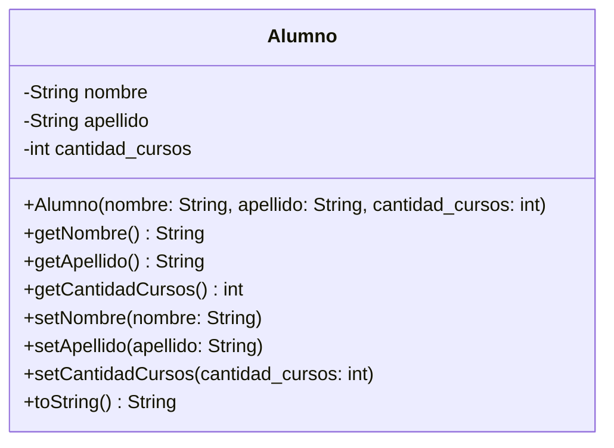

# Clase Once - 10 de Abril del 2026

# Repaso

* Proceso de Desarrollo
  * Evolucion Historica
  * El Perfil del desarrollador del Futuro
      * Optimizar la calidad del codigo
          * Clean Code
              * https://www.amazon.com/s?k=clean+code+by+robert+c+martin&language=es_US
              * Los mandamiento de La programacion
                  * No Hardcodear Valores  <<<
      * Enfocado en System Desgin
* Proyecto Integrador
  * Modificamos el Cursos
  * Agregamos una clase alumno
  * Python
      * Los metodos que tienen __ (doble guion bajo) antes y despues son metodos "especiales" que se llaman "metodos magicos" o "metodos dunder"
  * Deuda Cognitiva
      * Constructores
      * Self
      * @classmethod @staticmethod   << Metodos de Clase y Metodos de Instancia
      * Setters, Gettters, Encapsulamiento

# Frase Destacadas de la clase

* "El futuro es saber un poco de todo"
    * Maria Jose dixit
* "Sii obvio , tmb eso da a pie que con la ia salgan nuevos lenguajes mas eficientes"
    * Julian Muñoz
    
# Plan para la clase de Hoy

* Hablar un poco de lenguajes de programacion
* Hablar de la POO
* Ver la deuda cognitiva

# Progracion Orientada a Objetos

## Lenguajes de Programacion

* La POO es general y no esta asociada a un lenguaje de programacion especifico
* Si vemos ejemplos de los conceptos del POO implementados en distintoas lenguaje nos ayuda a pensar mas a alla de python o el lenguaje concreto
* Yo voy a usar la IA para hacer un proyecto puede ser bueno elegir el lenguaje de programacion Adecuado para el proyecto en cuestion

* Python
```
class Alumno:
    #Constuctor
    def __init__(self, nombre, apellido, cantidad_cursos):
        self.nombre = nombre
        self.apellido = apellido
        self.cantidad_cursos = cantidad_cursos
    
    def __str__(self):
        return f"{self.nombre} {self.apellido} - {self.cantidad_cursos} cursos"

# Ejemplo de uso
alumno1 = Alumno("Juan", "Pérez", 3)
```

* Java
```
public class Alumno {
    private String nombre;
    private String apellido;
    private int cantidadCursos;
    
    // Constructor
    public Alumno(String nombre, String apellido, int cantidadCursos) {
        this.nombre = nombre;
        this.apellido = apellido;
        this.cantidadCursos = cantidadCursos;
    }
    
    // Getters
    public String getNombre() {
        return nombre;
    }
    
    public String getApellido() {
        return apellido;
    }
    
    public int getCantidadCursos() {
        return cantidadCursos;
    }
    
    // Setters
    public void setNombre(String nombre) {
        this.nombre = nombre;
    }
    
    public void setApellido(String apellido) {
        this.apellido = apellido;
    }
    
    public void setCantidadCursos(int cantidadCursos) {
        this.cantidadCursos = cantidadCursos;
    }
    
    // toString
    @Override
    public String toString() {
        return nombre + " " + apellido + " - " + cantidadCursos + " cursos";
    }
}

//Ejemplo de Uso
Alumno alumno1 = new Alumno("Juan", "Pérez", 3);
```

* Javascript (ES-6) Mas moderna

```jascript
class Alumno {
    constructor(nombre, apellido, cantidadCursos) {
        this.nombre = nombre;
        this.apellido = apellido;
        this.cantidadCursos = cantidadCursos;
    }
    
    // Getters
    getNombre() {
        return this.nombre;
    }
    
    getApellido() {
        return this.apellido;
    }
    
    getCantidadCursos() {
        return this.cantidadCursos;
    }
    
    // Setters
    setNombre(nombre) {
        this.nombre = nombre;
    }
    
    setApellido(apellido) {
        this.apellido = apellido;
    }
    
    setCantidadCursos(cantidadCursos) {
        this.cantidadCursos = cantidadCursos;
    }
    
    // toString
    toString() {
        return `${this.nombre} ${this.apellido} - ${this.cantidadCursos} cursos`;
    }
}

// Uso
const alumno1 = new Alumno("Juan", "Pérez", 3);
const alumno2 = new Alumno("María", "García", 5);

console.log(alumno1.toString());
console.log(alumno2.toString());
```

* Javascript (Old-School)

```javascript
function Alumno(nombre, apellido, cantidadCursos) {
    this.nombre = nombre;
    this.apellido = apellido;
    this.cantidadCursos = cantidadCursos;
}

// Métodos en el prototipo
Alumno.prototype.getNombre = function() {
    return this.nombre;
};

Alumno.prototype.getApellido = function() {
    return this.apellido;
};

Alumno.prototype.getCantidadCursos = function() {
    return this.cantidadCursos;
};

Alumno.prototype.setNombre = function(nombre) {
    this.nombre = nombre;
};

Alumno.prototype.setApellido = function(apellido) {
    this.apellido = apellido;
};

Alumno.prototype.setCantidadCursos = function(cantidadCursos) {
    this.cantidadCursos = cantidadCursos;
};

Alumno.prototype.toString = function() {
    return `${this.nombre} ${this.apellido} - ${this.cantidadCursos} cursos`;
};

// Uso
const alumno1 = new Alumno("Juan", "Pérez", 3);
const alumno2 = new Alumno("María", "García", 5);

console.log(alumno1.toString());
console.log(alumno2.toString());
```

* En Rust
```
pub struct Alumno {
    nombre: String,
    apellido: String,
    cantidad_cursos: u32,
}

impl Alumno {
    // Constructor
    pub fn new(nombre: String, apellido: String, cantidad_cursos: u32) -> Self {
        Alumno {
            nombre,
            apellido,
            cantidad_cursos,
        }
    }
    
    // Getters
    pub fn get_nombre(&self) -> &str {
        &self.nombre
    }
    
    pub fn get_apellido(&self) -> &str {
        &self.apellido
    }
    
    pub fn get_cantidad_cursos(&self) -> u32 {
        self.cantidad_cursos
    }
    
    // Setters
    pub fn set_nombre(&mut self, nombre: String) {
        self.nombre = nombre;
    }
    
    pub fn set_apellido(&mut self, apellido: String) {
        self.apellido = apellido;
    }
    
    pub fn set_cantidad_cursos(&mut self, cantidad_cursos: u32) {
        self.cantidad_cursos = cantidad_cursos;
    }
    
    // Método display
    pub fn mostrar(&self) -> String {
        format!("{} {} - {} cursos", self.nombre, self.apellido, self.cantidad_cursos)
    }
}

// Implementar Display para println!
impl std::fmt::Display for Alumno {
    fn fmt(&self, f: &mut std::fmt::Formatter) -> std::fmt::Result {
        write!(f, "{} {} - {} cursos", self.nombre, self.apellido, self.cantidad_cursos)
    }
}
```

* UML (Unfified Modeling Language)
 * Me permite hacer el dibujo del sistema como si fuera el plano de la casa sin programarlo
   



* Diferencias
  * En python el constructor declara los atributos
  * En otos lenguajes los atriburos los puedo declarar aparte y puedo tener constructores vacios
  * En JAVA (y en los otros lenguajes) se ve que hay setters y getters (y que corno es esto) y en Python no  <<<<<
  * El constructor se escribe distinto segun el lenguaje (Todos tienen constructor pero cambia la forma __init___, Alumno, construnctor)

* Antes
  * Sistemas ENORMES
* Ahora
   * Sistemas Mas chicos que se comunicas

* Observaciones
   * Python no es la mejor opcion para aprender POO. Se puede pero los que hicieron el lenguaje priorizaron otras cosas : facilida de lectura, menos codigo, 
      * Admite programar sin objetos con programacion estructurada
      * Pithon tiene un ecosistema de librerias GIGANTE.
      * Cada vez que haces algo no hay que reinventar la rueda
      * MAs facil para sistemas Chicos
   * C# y Java son lenguajes fuertemente tipados que llevaban la POO como bandera, era algo fundamental de como se concibio
      * Te obligan a programar en objetos
      * Ideales para sistemas GRANDES, son mas seguros, 

## Hablar de la POO

* Hay dos Enfonques
   * Clasico : Una sintaxis para aprender a programar de una forma determinada
   * System Design : Una forma de pensar y organizar un sistema para que sea facil de mantener y entender
       * Donde nosotros como personas hoy en dia aportamos el CRITERIO

## Conceptos

* Contructor : El inicializados de un objeto. Cuando creas un objeto se ejecuta si o si este metodo y adentro hay un molde como quiero que sean los objetos del mismo tipo (clase) al principio. Al momento de crear el objeto con el constructor se pide memoria en un lugar de la memoria que generalmente se llama HEAP.
