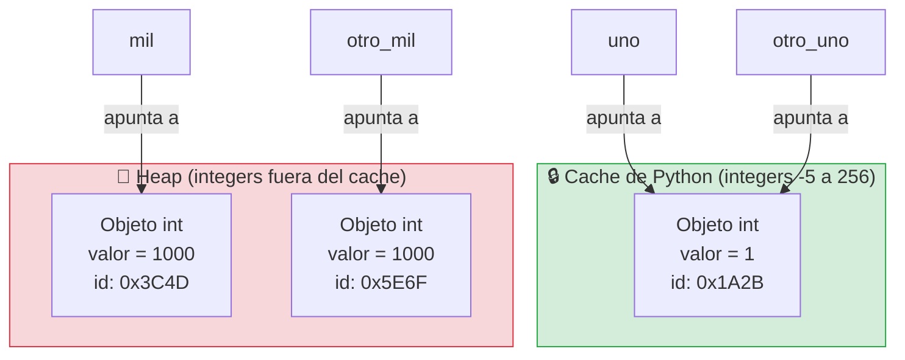

# Clase Tres -11 de Marzo del 2026

# Repaso

* Git
  * Creamos el Repo
  * Comandos basicos
    * Bajar un repo : git clone <URL Repo>
    * Marcar los archivos para agregar a stagging (local) : git add *
    * Mostrar los cambios pendientes de confirmar : git status
    * Como confirmo los cambios a stagging (local) : git commit -m "Mensaje explicativo"
    * Subir las cosas al repositorio remoto (internet) : stagging -> Remoto : git push   o   git push origin main
    * Como bajo las cosas que otros subieron al repositorio remoto : git pull
* Python
  * Librerias
      * Pygame : armamos un juego con la ayuda de la IA
      * Django : Para apps web
      * Aprendimos a instalar librerias localmente : pip install <nombre de la libreria>
  * Tipos de datos Basicos en Python
* VScode
  * Extensiones
    * LiveShare
  

# Python

* Colab de la clase

> https://colab.research.google.com/drive/1xxylHwghOsgva9GNl6qwPvIrx51jJtUR?usp=sharing

# Condicionales

* Vimos el IF
* 
```python
#Importo el objeto random que ya existe en python y lo programo otro
import random

#Le pido al objeto random que me un numero entre 1 y 10
random_number = random.randint(1, 10)

if random_number > 5:
  variable  = 10
else: 
  variable = "Hola"

if isinstance(variable, int):
  print("La variable es un entero")
elif isinstance(variable, str):
  print("La variable es un string")
```

## Tipos de Datos y Objetos

* Built-in functions (son funciones que vienen con el lenguaje)
  * print
  * input
  * type
  * dir
  * isinstance
  * id

* Funciones de objetos
  * Los objetos/variables de tipo str
    * upper
    * replace
  *  Los objetos/variables de tipo int
    *  bit_length

## Operadores

* == : Compara el contenido de dos variables
* is : Dice si las dos variables son el mismo objeto

## Identidades de objetos en python


```pyton
# Curiosidad de python

uno = 1
otro_uno = 1
print(id(uno))
print(id(otro_uno))
# Da lo mismo!!! 

if uno == otro_uno:
  print("Las dos variables almacenan el mismo valor")

if uno is otro_uno:
  print("Las dos variables son el mismo objeto, son lo mismo")

mil = 1000
otro_mil = 1000
print(id(mil))
print(id(otro_mil))

if mil == otro_mil:
  print("Las dos variables almacenan el mismo valor")

if not(mil is otro_uno):
  print("Las dos variables no son el mismo objeto, son objetos distintos")

# Porque pasa esto???
# 
```



# Puntos flotantes

* Las compus son muy buenas para manejar numeros enteros, pero hay numeros de punto flotante que no se pueden repesentar bien
* Esto tiene que ver con la forma que las computadoras almacenan los numeros de punto flotante
* Para aplicaciones cientificas, juegos, esto generalmente no es un problema porque son aproximaciones lo suficientemente buenas

```python
print(0.1 + 0.2)
```

* Deberia dar

```
0.30000000000000004

```

* Para aplicaciones financieras se invento el decimal que trabaja con una cantidad finita de decimales

```pyton
from decimal import Decimal

num1 = Decimal('0.1')
# En la computadora no se puede representar el 0.2 en flotante. Por eso u samos string
num2 = Decimal('0.2')
print(num1 + num2)
```
* Ahi da...
```
0.3
```

## Entornos Virtuales

* Cuando instalaba un programa con pip install donde lo instaba?
 * Los instalaba global para todos mis programas en python
 * Se puede ver donde estan con
    * pip --version
    * pip show <Nombre libreria>
* Ahora que pasa cuando tendo dos programas que usan la misma liberia pero necesitan versiones distintas?????
   * En ese caso hay que usar ENTORNOS VIRTUALES
   * Que son entornos aislados que tienen una copia de la libreria que usa mi programa
* El lio de las librerias no es solo en python cada lenguaje tiene su administrador de paquetes

 


## Tipos de Aplicaciones

## Para hacer 

* Pueden hacer los desafios y laboratorios del Modulo 1


