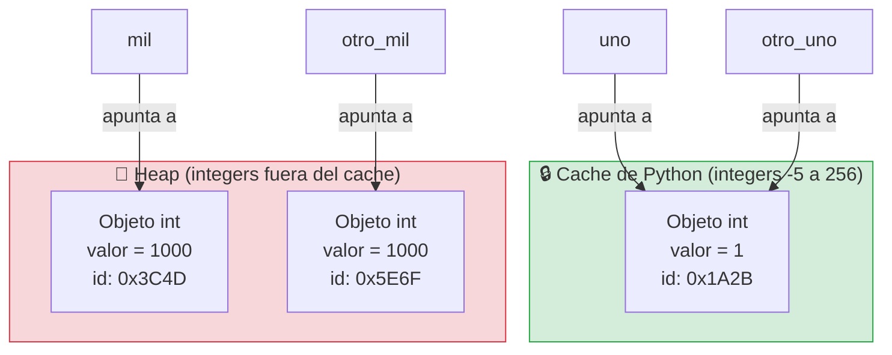

# Clase Tres -11 de Marzo del 2026

# Repaso

* Git
  * Creamos el Repo
  * Comandos basicos
    * Bajar un repo : git clone <URL Repo>
    * Marcar los archivos para agregar a stagging (local) : git add *
    * Mostrar los cambios pendientes de confirmar : git status
    * Como confirmo los cambios a stagging (local) : git commit -m "Mensaje explicativo"
    * Subir las cosas al repositorio remoto (internet) : stagging -> Remoto : git push   o   git push origin main
    * Como bajo las cosas que otros subieron al repositorio remoto : git pull
* Python
  * Librerias
      * Pygame : armamos un juego con la ayuda de la IA
      * Django : Para apps web
      * Aprendimos a instalar librerias localmente : pip install <nombre de la libreria>
  * Tipos de datos Basicos en Python
* VScode
  * Extensiones
    * LiveShare
  

# Python

* Colab de la clase

> https://colab.research.google.com/drive/1xxylHwghOsgva9GNl6qwPvIrx51jJtUR?usp=sharing

# Condicionales

* Vimos el IF
* 
```python
#Importo el objeto random que ya existe en python y lo programo otro
import random

#Le pido al objeto random que me un numero entre 1 y 10
random_number = random.randint(1, 10)

if random_number > 5:
  variable  = 10
else: 
  variable = "Hola"

if isinstance(variable, int):
  print("La variable es un entero")
elif isinstance(variable, str):
  print("La variable es un string")
```

## Tipos de Datos y Objetos

* Built-in functions (son funciones que vienen con el lenguaje)
  * print
  * input
  * type
  * dir
  * isinstance
  * id

* Funciones de objetos
  * Los objetos/variables de tipo str
    * upper
    * replace
  *  Los objetos/variables de tipo int
    *  bit_length

## Operadores

* == : Compara el contenido de dos variables
* is : Dice si las dos variables son el mismo objeto

## Identidades de objetos en python


```pyton
# Curiosidad de python

uno = 1
otro_uno = 1
print(id(uno))
print(id(otro_uno))
# Da lo mismo!!! 

if uno == otro_uno:
  print("Las dos variables almacenan el mismo valor")

if uno is otro_uno:
  print("Las dos variables son el mismo objeto, son lo mismo")

mil = 1000
otro_mil = 1000
print(id(mil))
print(id(otro_mil))

if mil == otro_mil:
  print("Las dos variables almacenan el mismo valor")

if not(mil is otro_uno):
  print("Las dos variables no son el mismo objeto, son objetos distintos")

# Porque pasa esto???
# 
```



# Puntos flotantes

* Las compus son muy buenas para manejar numeros enteros, pero hay numeros de punto flotante que no se pueden repesentar bien
* Esto tiene que ver con la forma que las computadoras almacenan los numeros de punto flotante
* Para aplicaciones cientificas, juegos, esto generalmente no es un problema porque son aproximaciones lo suficientemente buenas

```python
print(0.1 + 0.2)
```

* Deberia dar

```
0.30000000000000004

```

* Para aplicaciones financieras se invento el decimal que trabaja con una cantidad finita de decimales

```pyton
from decimal import Decimal

num1 = Decimal('0.1')
# En la computadora no se puede representar el 0.2 en flotante. Por eso u samos string
num2 = Decimal('0.2')
print(num1 + num2)
```
* Ahi da...
```
0.3
```

## Entornos Virtuales

* Cuando instalaba un programa con pip install donde lo instaba?
 * Los instalaba global para todos mis programas en python
 * Se puede ver donde estan con
    * pip --version
    * pip show <Nombre libreria>
* Ahora que pasa cuando tendo dos programas que usan la misma liberia pero necesitan versiones distintas?????
   * En ese caso hay que usar ENTORNOS VIRTUALES
   * Que son entornos aislados que tienen una copia de la libreria que usa mi programa
* El lio de las librerias no es solo en python cada lenguaje tiene su administrador de paquetes


 * Vamos a crear una aplicacion de escritorio con la libreria tkinter (https://tkinter.com/) usando la ia
```
Haceme una aplicacion de ejemplo en python de ventanas utilizando la llbreria tkinter
```
* Claude me hizo lo siguiente
```python
import tkinter as tk
from tkinter import ttk, messagebox, filedialog
from datetime import datetime


# ──────────────────────────────────────────────
#  Ventana principal
# ──────────────────────────────────────────────
class App(tk.Tk):
    def __init__(self):
        super().__init__()
        self.title("Demo Tkinter – Ejemplo Completo")
        self.geometry("720x540")
        self.resizable(True, True)
        self.configure(bg="#1e1e2e")

        # Estilo general
        self._aplicar_estilo()

        # Barra lateral + área de contenido
        self._construir_layout()

    # ── Estilos ttk ──────────────────────────
    def _aplicar_estilo(self):
        style = ttk.Style(self)
        style.theme_use("clam")

        # Notebook (pestañas)
        style.configure("TNotebook",           background="#1e1e2e", borderwidth=0)
        style.configure("TNotebook.Tab",       background="#313244", foreground="#cdd6f4",
                        padding=[12, 6], font=("Consolas", 10, "bold"))
        style.map("TNotebook.Tab",
                  background=[("selected", "#cba6f7")],
                  foreground=[("selected", "#1e1e2e")])

        # Frame
        style.configure("Card.TFrame",         background="#313244", relief="flat")

        # Botón
        style.configure("Accent.TButton",      background="#cba6f7", foreground="#1e1e2e",
                        font=("Consolas", 10, "bold"), padding=[10, 6])
        style.map("Accent.TButton",
                  background=[("active", "#a6e3a1")])

        # Etiqueta
        style.configure("TLabel",              background="#1e1e2e", foreground="#cdd6f4",
                        font=("Consolas", 11))
        style.configure("Title.TLabel",        background="#1e1e2e", foreground="#cba6f7",
                        font=("Consolas", 14, "bold"))

        # Entry
        style.configure("TEntry",              fieldbackground="#45475a", foreground="#cdd6f4",
                        insertcolor="#cdd6f4", font=("Consolas", 11))

        # Scrollbar
        style.configure("TScrollbar",          background="#313244", troughcolor="#1e1e2e",
                        arrowcolor="#cba6f7")

        # Progressbar
        style.configure("TProgressbar",        troughcolor="#313244", background="#a6e3a1",
                        thickness=14)

        # Combobox
        style.configure("TCombobox",           fieldbackground="#45475a", foreground="#cdd6f4",
                        background="#45475a", font=("Consolas", 11))
        style.map("TCombobox",
                  fieldbackground=[("readonly", "#45475a")])

        # Checkbutton / Radiobutton
        for w in ("TCheckbutton", "TRadiobutton"):
            style.configure(w, background="#1e1e2e", foreground="#cdd6f4",
                            font=("Consolas", 11))

        # Treeview
        style.configure("Treeview",            background="#313244", fieldbackground="#313244",
                        foreground="#cdd6f4", rowheight=26, font=("Consolas", 10))
        style.configure("Treeview.Heading",    background="#45475a", foreground="#cba6f7",
                        font=("Consolas", 10, "bold"))
        style.map("Treeview", background=[("selected", "#cba6f7")],
                  foreground=[("selected", "#1e1e2e")])

    # ── Layout ───────────────────────────────
    def _construir_layout(self):
        # Título
        ttk.Label(self, text="✦  Demo Tkinter", style="Title.TLabel").pack(
            side="top", anchor="w", padx=20, pady=(14, 4))

        # Separador
        tk.Frame(self, bg="#cba6f7", height=2).pack(fill="x", padx=20, pady=(0, 10))

        # Notebook con pestañas
        nb = ttk.Notebook(self)
        nb.pack(fill="both", expand=True, padx=20, pady=(0, 16))

        nb.add(PestañaFormulario(nb), text="  📝 Formulario  ")
        nb.add(PestañaLista(nb),      text="  📋 Lista  ")
        nb.add(PestañaProgreso(nb),   text="  ⏳ Progreso  ")
        nb.add(PestañaTexto(nb),      text="  📄 Texto  ")


# ──────────────────────────────────────────────
#  Pestaña 1 – Formulario
# ──────────────────────────────────────────────
class PestañaFormulario(ttk.Frame):
    def __init__(self, parent):
        super().__init__(parent, style="Card.TFrame", padding=20)
        self._construir()

    def _construir(self):
        # Nombre
        ttk.Label(self, text="Nombre:").grid(row=0, column=0, sticky="w", pady=6)
        self.nombre = ttk.Entry(self, width=30)
        self.nombre.grid(row=0, column=1, sticky="ew", padx=(10, 0), pady=6)

        # Email
        ttk.Label(self, text="Email:").grid(row=1, column=0, sticky="w", pady=6)
        self.email = ttk.Entry(self, width=30)
        self.email.grid(row=1, column=1, sticky="ew", padx=(10, 0), pady=6)

        # País
        ttk.Label(self, text="País:").grid(row=2, column=0, sticky="w", pady=6)
        self.pais = ttk.Combobox(self, state="readonly", width=28,
                                 values=["Argentina", "Brasil", "Chile",
                                         "Colombia", "México", "España"])
        self.pais.set("Argentina")
        self.pais.grid(row=2, column=1, sticky="ew", padx=(10, 0), pady=6)

        # Opciones
        self.notif = tk.BooleanVar(value=True)
        ttk.Checkbutton(self, text="Recibir notificaciones",
                        variable=self.notif).grid(row=3, column=0, columnspan=2,
                                                  sticky="w", pady=6)

        self.genero = tk.StringVar(value="otro")
        frame_radio = ttk.Frame(self, style="Card.TFrame")
        frame_radio.grid(row=4, column=0, columnspan=2, sticky="w", pady=6)
        ttk.Label(frame_radio, text="Género: ").pack(side="left")
        for val, txt in [("m", "Masculino"), ("f", "Femenino"), ("otro", "Otro")]:
            ttk.Radiobutton(frame_radio, text=txt,
                            variable=self.genero, value=val).pack(side="left", padx=6)

        # Botón
        ttk.Button(self, text="Enviar formulario", style="Accent.TButton",
                   command=self._enviar).grid(row=5, column=0, columnspan=2,
                                              pady=(18, 0))
        self.columnconfigure(1, weight=1)

    def _enviar(self):
        n = self.nombre.get().strip()
        e = self.email.get().strip()
        if not n or not e:
            messagebox.showwarning("Campos vacíos", "Completá nombre y email.")
            return
        messagebox.showinfo(
            "Enviado ✓",
            f"Nombre : {n}\nEmail  : {e}\nPaís   : {self.pais.get()}\n"
            f"Notif. : {'Sí' if self.notif.get() else 'No'}\n"
            f"Género : {self.genero.get()}"
        )


# ──────────────────────────────────────────────
#  Pestaña 2 – Lista / Treeview
# ──────────────────────────────────────────────
class PestañaLista(ttk.Frame):
    def __init__(self, parent):
        super().__init__(parent, style="Card.TFrame", padding=20)
        self._datos = [
            ("Alice",   "alice@mail.com",   "Argentina"),
            ("Bob",     "bob@mail.com",     "Brasil"),
            ("Carlos",  "carlos@mail.com",  "Chile"),
        ]
        self._construir()

    def _construir(self):
        cols = ("Nombre", "Email", "País")
        self.tree = ttk.Treeview(self, columns=cols, show="headings", height=8)
        for c in cols:
            self.tree.heading(c, text=c)
            self.tree.column(c, width=180)
        self.tree.pack(fill="both", expand=True)

        for fila in self._datos:
            self.tree.insert("", "end", values=fila)

        # Controles
        frame = ttk.Frame(self, style="Card.TFrame")
        frame.pack(fill="x", pady=(12, 0))

        self.entry = ttk.Entry(frame, width=20)
        self.entry.insert(0, "Nuevo nombre")
        self.entry.pack(side="left", padx=(0, 8))

        ttk.Button(frame, text="➕ Agregar", style="Accent.TButton",
                   command=self._agregar).pack(side="left", padx=4)
        ttk.Button(frame, text="🗑 Eliminar", style="Accent.TButton",
                   command=self._eliminar).pack(side="left", padx=4)

    def _agregar(self):
        nombre = self.entry.get().strip()
        if nombre:
            self.tree.insert("", "end",
                             values=(nombre, f"{nombre.lower()}@mail.com", "—"))

    def _eliminar(self):
        sel = self.tree.selection()
        if sel:
            self.tree.delete(sel[0])
        else:
            messagebox.showinfo("Info", "Seleccioná una fila primero.")


# ──────────────────────────────────────────────
#  Pestaña 3 – Barra de progreso + reloj
# ──────────────────────────────────────────────
class PestañaProgreso(ttk.Frame):
    def __init__(self, parent):
        super().__init__(parent, style="Card.TFrame", padding=20)
        self._corriendo = False
        self._construir()
        self._tick()

    def _construir(self):
        # Reloj
        self.lbl_hora = ttk.Label(self, text="", style="Title.TLabel")
        self.lbl_hora.pack(pady=(0, 20))

        # Progreso determinado
        ttk.Label(self, text="Progreso manual:").pack(anchor="w")
        self.prog = ttk.Progressbar(self, length=400, maximum=100)
        self.prog.pack(fill="x", pady=(4, 12))

        frame = ttk.Frame(self, style="Card.TFrame")
        frame.pack()
        ttk.Button(frame, text="◀ −10", style="Accent.TButton",
                   command=lambda: self._mover(-10)).pack(side="left", padx=6)
        ttk.Button(frame, text="+10 ▶", style="Accent.TButton",
                   command=lambda: self._mover(10)).pack(side="left", padx=6)
        ttk.Button(frame, text="Reset", style="Accent.TButton",
                   command=lambda: self._set(0)).pack(side="left", padx=6)

        # Progreso indeterminado
        ttk.Label(self, text="\nCarga indeterminada:").pack(anchor="w")
        self.prog_ind = ttk.Progressbar(self, length=400, mode="indeterminate")
        self.prog_ind.pack(fill="x", pady=(4, 12))

        self.btn_toggle = ttk.Button(self, text="▶ Iniciar", style="Accent.TButton",
                                     command=self._toggle)
        self.btn_toggle.pack()

    def _tick(self):
        self.lbl_hora.config(text=f"🕐  {datetime.now().strftime('%H:%M:%S')}")
        self.after(1000, self._tick)

    def _mover(self, delta):
        val = min(100, max(0, self.prog["value"] + delta))
        self._set(val)

    def _set(self, val):
        self.prog["value"] = val

    def _toggle(self):
        self._corriendo = not self._corriendo
        if self._corriendo:
            self.prog_ind.start(12)
            self.btn_toggle.config(text="⏹ Detener")
        else:
            self.prog_ind.stop()
            self.btn_toggle.config(text="▶ Iniciar")


# ──────────────────────────────────────────────
#  Pestaña 4 – Editor de texto
# ──────────────────────────────────────────────
class PestañaTexto(ttk.Frame):
    def __init__(self, parent):
        super().__init__(parent, style="Card.TFrame", padding=20)
        self._construir()

    def _construir(self):
        # Barra de herramientas
        barra = ttk.Frame(self, style="Card.TFrame")
        barra.pack(fill="x", pady=(0, 8))

        ttk.Button(barra, text="📂 Abrir",   style="Accent.TButton",
                   command=self._abrir).pack(side="left", padx=4)
        ttk.Button(barra, text="💾 Guardar", style="Accent.TButton",
                   command=self._guardar).pack(side="left", padx=4)
        ttk.Button(barra, text="🗑 Limpiar", style="Accent.TButton",
                   command=self._limpiar).pack(side="left", padx=4)

        # Área de texto + scrollbar
        frame_txt = ttk.Frame(self, style="Card.TFrame")
        frame_txt.pack(fill="both", expand=True)

        scroll = ttk.Scrollbar(frame_txt)
        scroll.pack(side="right", fill="y")

        self.txt = tk.Text(frame_txt, wrap="word",
                           bg="#45475a", fg="#cdd6f4",
                           insertbackground="#cba6f7",
                           font=("Consolas", 11),
                           relief="flat", padx=10, pady=8,
                           yscrollcommand=scroll.set)
        self.txt.pack(fill="both", expand=True)
        scroll.config(command=self.txt.yview)

        self.txt.insert("1.0",
            "Bienvenido al editor de texto.\n\n"
            "Podés abrir un archivo .txt, editarlo y guardarlo.\n"
            "Este widget soporta scroll, selección, copiar/pegar, etc.")

    def _abrir(self):
        path = filedialog.askopenfilename(
            filetypes=[("Archivos de texto", "*.txt"), ("Todos", "*.*")])
        if path:
            with open(path, encoding="utf-8", errors="replace") as f:
                self.txt.delete("1.0", "end")
                self.txt.insert("1.0", f.read())

    def _guardar(self):
        path = filedialog.asksaveasfilename(
            defaultextension=".txt",
            filetypes=[("Archivos de texto", "*.txt"), ("Todos", "*.*")])
        if path:
            with open(path, "w", encoding="utf-8") as f:
                f.write(self.txt.get("1.0", "end-1c"))
            messagebox.showinfo("Guardado", f"Archivo guardado en:\n{path}")

    def _limpiar(self):
        if messagebox.askyesno("Confirmar", "¿Borrar todo el texto?"):
            self.txt.delete("1.0", "end")


# ──────────────────────────────────────────────
if __name__ == "__main__":
    app = App()
    app.mainloop()
```

* Si hago esto
```
>python demo-tkinter.py
```
* Y no tengo la libreria instalada me da este error
```
ModuleNotFoundError: No module named 'tkinter'
```
* Ahi deberia instalar tkinter con pip install pero es para toda la computadora

### Creacion de entornos virtuales

* Crear el entorno virtual
```
python -m venv <nombre>
```
* Por ejemplo
```
python -m venv venv
```
* Esto creo el entorno virtual llamado venv y me fijo que me creo una carpeta con ese nombre donde se instalan todas las librerias
* Se puede tener varios entornos virtuales en el mismo proyeto
* Vamos a ACTIVAR (es decir nos vamos a parar en) el entorno virtual
* En CMD se pone:
```
venv\Scripts\activate
```
* En Powershell se pone:
```
.\venv\Scripts\Activate.ps1  
```
* En MAC hay que poner
```
source venv/bin/activate
```
* donde venv es la carpeta que se creo que tiene el nombre del entorno
* Aparece algo asi
```
(venv) C:\Cursos\fullstack-ai-dev\clases\clase-tres>
```
* Instalo una libreria
```
pip install pandas
```
* Cuando lo ejecuto dentro del entorno usa las librerias locales
```
(venv) C:\Cursos\fullstack-ai-dev\clases\clase-tres>python demo-tkinter.py
```
* Ahi se ve que estoy dentro del entorno (venv)

## Para hacer 

* Pueden hacer los desafios y laboratorios del Modulo 1


