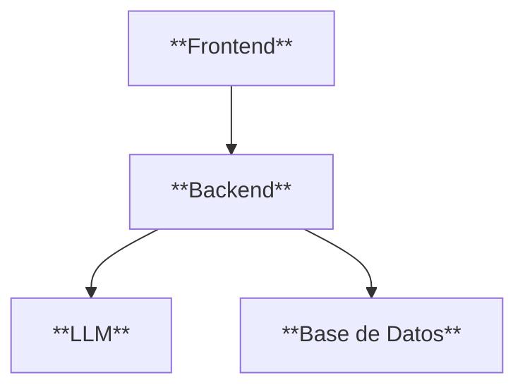

# Clase UNO - 4 de Marzo de 2026

# Roadmap

  * Python
    * https://www.instagram.com/p/C_VyOHHRv0N/?img_index=4
  * System Design
     * Programacio Orientada a Objetos
     * Diseniar/Diagramar la solucion
  * Git
     * Lo vamos au sar en todo el curso
  * Base De Datos Relacionales
     * SQL
     * SQlite / Postgres / MySQL
  * IA Para Programadores
     * Vamos a programar con IA y ver herramientas que me ayuden a programar
     * Como utilizar la IA con criterio para programar
     * https://www.instagram.com/p/DJrpLZWgqJr/?img_index=1
  * Aplicacaiones Inteligentes
     * Uso de LLM mediante API Key
     * Agentes
        * Agentes Conversacionales (Chatbot pero especializado en algo : Atencion al cliente)
        * Agentes Autonomos

# Arquitectura Full-Stack

* Front-end
* Backend
  * Base De Datos Relacionales


Diagrama hecho con Mermaid : https://mermaid.live/

# Git


# Tareas

  * Crear un repositorio en Github con el suiente nombre : BOTTCAMP-EDIT-[Apellido]
  * Completar el google form del profe donde informan la url del repo
     * https://docs.google.com/forms/d/e/1FAIpQLSeSmBBJUom8mr4bj0jdyskUxEDx_h4GU81rKOsOwuA3hxQliA/viewform?usp=publish-editor
  * Avisarle al profe cada tanto "Hacele commit"
  * Asegurarse de tener instalado python
   * Si en la terminal pones : python
```
C:\Users\esteb>python
Python 3.11.1 (tags/v3.11.1:a7a450f, Dec  6 2022, 19:58:39) [MSC v.1934 64 bit (AMD64)] on win32
Type "help", "copyright", "credits" or "license" for more information.

C:\Users\esteb>pip --version
pip 25.3 from C:\Coding\Python\Lib\site-packages\pip (python 3.11)
``` 
  * Una hora antes el profesor se va a estar conectando en Discord (18:00)
  * Seguir al profe en su IG Profesional : https://www.instagram.com/mct.esteban.calabria/ (mct.esteban.calabria@...gmail...)
  * 
  
# Herramientas

  * Google Colab
    * https://developers.google.com/colab
  * Python
    * https://www.python.org/
   * Terminal
      * Se abre con CMD o Powershell
    * Alguna IDE como Visual Studio Code
        * https://code.visualstudio.com/
        * El que lo prefiere y conoce puede unar otra IDE
             * https://cursor.com/
             * https://antigravity.google/
             * https://windsurf.com/          

# Python 

* https://www.tiobe.com/tiobe-index/
* https://risingstars.js.org/2025/en

* Colab que vamos ausar esta clase:
   * https://colab.research.google.com/drive/1MUluNBY9ohn7z695XWCgirS8J7U_SgIy?usp=sharing

# IA para programadores

* https://claude.ai/
  * IA Mas para programar...
