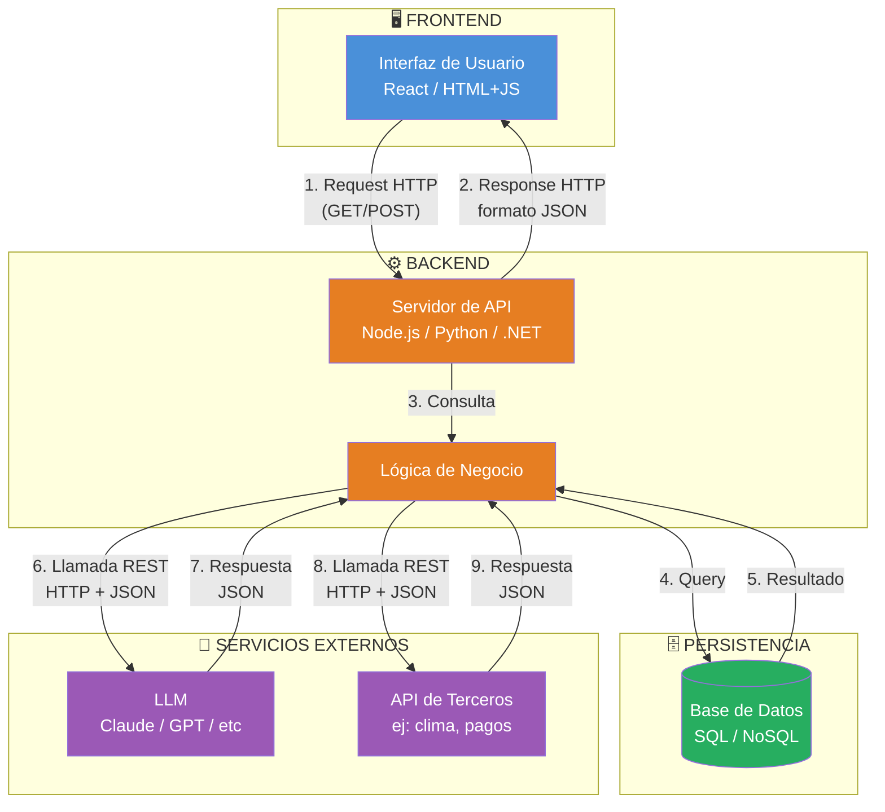

# Bootcamp - Full Stack AI Dev

# Clase Uno  - 5 de Agosto 2026

# Roadmap

* Git
  * Github
* Full Stack
   * HTTP / HTTPS
   * HTML
   * API Rest
     * Ejemplo : https://rickandmortyapi.com/
   * Backend / Frontend
   * JSON
* Desarrollo en Python
   * Lenguaje que exploto de con el tema de la IA
   * Su popularidad la podemos ver en https://www.tiobe.com/tiobe-index/
* Programacion Orientada a Objetos
  * No tanto desde la perspectiva de la programacion sino desde la organizacion de un sistema
  * System Design (Arquitectos de Sistemas)
    * Como organizar, estructurar y diseniar un sistema para que sea facil de mantener y sea viable ediarlo con IA
  * Pruebas Unitarias
* Base de DAtos
    * SQLServer / PostgresSQL / SQLIte
* IA para desarrolladores
  * Como utilizar la IA en cada etapa del proyecto
    * Desde el analisis, base de datos hasta el despliegue
  * Herramientas de IA para desarrollar
  * Buenas practicas de como utilizar la Ia para desarrollar
    * Evitar la **deuda cognitiva**
* Desarrollo de Agentes con IA
  * Uso de LLM dentro de nuestro programa
  * Agentes
    * Agentes Conversacionales
    * Agentes Autnomos

* Mini proyectos con IA
  * Super utiles para armar un portafolio para entrevistas de trabajo (por eso armar el github)    
* Proyecto Integrador
  * 80% Desarrollado en clase
  * El bootcamp pasado hicimos un proyecto de una universidad         

# Requerimientos

* Tener una cuenta en Github
  * https://github.com/
  * Dato copado, si tienen mail estudiantil pueden gestionar la cuenta de estudiantes y le dan el copilot pro (Gracias Facundo)
  * No es obligatorio que sea con el mail que usaron en EducacionIT 
* Van a crear un Repositorio con los entregables del curso que despues comparten con el profe
* Tener cuenta de google

## Herramientas y Programas Necesiarios

### VSCODE
* Tener Instalado VSCode
  * DEspues igual les voy a mostrar algunas otras alternativas
 
### Python

* Tener Instalado Python localmente
* Verificar si esta python instalado con
```
> python --version
```
* O bien
```
> python3 --version
```
* Si no aparece y le dice comando no reconocido
  * https://www.python.org/downloads/

> [!NOTE]
> Para usar python muchas veces vamos a hacer desde google Colab
> Otra data, si tienen cuenta de estudiante pueden tener google pro (Gemini pro y mas almacenamiento en la cuenta)

### Linea de comando

* En este curso vamos a utilizar mucho la linea de comando
* Ejecutar:
```
cmd
```

---

# Arquitectura Full Stack

* Para entender conceptualmente la forma de trabajar o la arquitectura del desarrollo que buscmos en el curso



---

# Uso de LLM para programar

* Claude
  * https://claude.ai/new
* Caracteristicas
  * Hoy x hoy es uno de los mejores LLM para programar
  * Es de Anthropic
  * Para confirmar que es una de los mejores podemos visitar arena.ai

* Primer prompt para programar en claude

```
Quiero que me desarrolles el juego pong en un unico artefacto (con previsualizacion) html / javascript que sea responsive, que sea profesional, que tenga efectos de particulaas y visuales. El jugador de la derecha se mueve con las teclas de cursor, y el de la izquierda con la a y la z. Con la barra espaciadora se comienza el juego  y se pausa el  mismo para reiniciar. Que se vea moderno. Estan mis alumnos observaando quiero que queden maravillados con lo que haces. Algunos es la primera vez que usan claude por eso te tenes que esmerar para quedar bien.
```

> [!NOTE]
> La palabra "artefacto" es propia de claude.

* Publique el artefacto y me genero:
  * https://claude.ai/public/artifacts/52da01d5-4c5a-46ea-a6a4-c85363bbd159

---

# Python

* Hoy hicmos un hola mundo en python en google colab

```python
print("Hola Mundo")
```

* Enlace de lo que hicimos esta clase:
  * https://colab.research.google.com/drive/1zUj-pqf_7sbnJ3Bd5pRC7iJoCN1w4xRL?usp=sharing

# Notivias y novedades

* MiduDev
  * https://www.youtube.com/@midudev

# Glosario

* **Deuda cognitiva** 
  * Cuando no sabes explicar o no sabes que hace tu propio código

# Proxima Clase

* No se olviden de crear su cuenta en github y dentro de github crear un repositorio (https://github.com/new)
  * Nombre del Repositorio : 87952-BOOTCAMP-<APELLIDO>
  * El profesor les va a pasar un formulario para que me envien la url del respositorio
