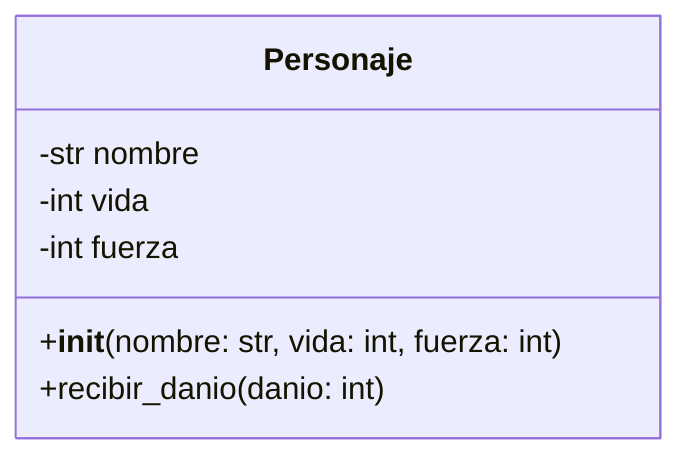

# Clase 13  - 21 de Septiembre del 2026

# Repaso

* POO
  * Antes se programaba estructurado como C, Pascal y en los 90's estalló el boom de la POO y se volvieron populares los lenguajes como Java, C#, C++
  * Costo de Manteniento Programacion estructurada vs POO
  * Mencionando Conceptos
    * Encapsulamiento
    * Herencia
    * Polimorfismo
  * Comparativa entre distintos lenguajes
    * Java
    * Python
    * C#
    * C++
  * Ejemplo usado clases o no
      * Clase Fraccion
  * Clase
    * Tipo de datos creado el usuario
    * Agrupa atributos y metodos relacionados
    * Las variables del tipo de una clase se llaman (instnacia de una clase) se llama objeto
  * Constructor
    * Es el metodo que usamos para crear un objeto
    * El metodo dunder __init__ en python

---

# Noticia

* Un robot que se agarro a las trompadas con una persona
  * https://www.youtube.com/watch?v=9xQfVj8EIA8
  * https://www.youtube.com/shorts/EddwTNHFdZ8
 
* Porque C# Se llama asi?
  * C -> C++ -> C++++ (Si superponemos los +) C#
 
----

# NOTA

* Se dice que la programacion orientada a objetos hace que los programas sean mas faciles de mantener
* Pero para que esto ocurra debemos tener en cuenta ciertas buenas practicas
* En la POO que algo funcione no necesesariamente implica que sea facil de mantgener

----

# Setup

* Colab de la clase
  * https://colab.research.google.com/drive/1BFYbNEGn3P8eVBdeGcqEwk-V8cI6u8iU?usp=sharing

----

# Programacion Orientada a Objetos

## Creacion de Objetos

* Los objetos se crean con un metodo especial que se llama constructor.
* En python se hace con el metodo dunder __init__
* En Java y otros lenguajes se utiliza el mismo nombre de la clase

* Python
```python
class Personaje:
    def __init__(self, nombre: str, vida: int, fuerza: int):
        if not nombre:
            raise ValueError("El nombre no puede estar vacío")
        if vida <= 0:
            raise ValueError("La vida debe ser mayor que 0")
        if fuerza <= 0:
            raise ValueError("La fuerza debe ser mayor que 0")

        self.nombre = nombre
        self.vida = vida
        self.fuerza = fuerza

   def recibir_danio(self, danio: int):
      if danio <= 0:
           raise ValueError("El daño debe ser mayor que 0")
      self.vida -= danio
```

* Java
```java
public class Personaje {

    private String nombre;
    private int vida;
    private int fuerza;

    public Personaje(String nombre, int vida, int fuerza) {
        if (nombre == null || nombre.isEmpty()) {
            throw new IllegalArgumentException("El nombre no puede estar vacío");
        }
        if (vida <= 0) {
            throw new IllegalArgumentException("La vida debe ser mayor que 0");
        }
        if (fuerza <= 0) {
            throw new IllegalArgumentException("La fuerza debe ser mayor que 0");
        }

        this.nombre = nombre;
        this.vida = vida;
        this.fuerza = fuerza;
    }

    public void recibirDanio(int danio) {
        if (danio <= 0) {
            throw new IllegalArgumentException("El daño debe ser mayor que 0");
        }

        this.vida -= danio;
    }
}
```

> [!NOTE]
> En python los metodos de la clase reciben el parametro explicito self.
> Python hace explícito algo que Java oculta en la firma del método.
> En python “Explicit is better than implicit.”

* Objetivo del constructor (En cualquier lenguaje)
  * Asegurar la creacion de un objeto consistente (que todos sus atributos tengan sentido para el problema que estamos tratando)
  * Lo de consistente tiene que ver con las validaciones
* Ej Objeto Inconsistente
  * Una fraccion con denominador 0
  * Un personaje sin nombre
  * Un objeto con datos incorrectos
  * Un objeto con combinaciones de atributos invalidas

* OJO ACa. La IA programa mal.

* Creame en python una clase persona que tenga nombre, apellido y edad...

```
class Persona:

    def __init__(self, nombre: str, apellido: str, edad: int):
        self.nombre = nombre
        self.apellido = apellido
        self.edad = edad
```

> El objeto debe proteger su propia consistencia desde el momento de su creación.


* La tuve que retar a la IA
  * https://chatgpt.com/share/6ab1b3da-1614-83e9-b04b-404653a9d3fb
 
* Pregunta
  * Mi pregunta es, que decide cuando se utiliza un constructor y cuando no? Mas alla de si tiene validaciones o no. Por que motivo no son todos constructores?
* Respuesta
  * Justamente por eso en Python es obligatorio el constructor porque es el unico lugar donde podemos definir los atributos
  * Java te permitia definir clases sin constructores
 
```
public class Personaje {

    private String nombre;
    private int vida;
    private int fuerza;

    public String getNombre() {
        return nombre;
    }

    public void setNombre(String nombre) {
        this.nombre = nombre;
    }

    public int getVida() {
        return vida;
    }

    public void setVida(int vida) {
        this.vida = vida;
    }

    public int getFuerza() {
        return fuerza;
    }

    public void setFuerza(int fuerza) {
        this.fuerza = fuerza;
    }
}
```

* Contra Ejemplo (Clase calculadora no tiene atributos)

```
class Calculadora:
  def sumar(self, a, b):
    return a + b

  def restar(self, a, b):
    return a - b
```

> "Una clase que no tiene atributos sólo serviría para agrupar funciones utilitarios pero que no representan un objeto de la vida real" Luis Dixit

---

# Principio POO 
# El objeto debe proteger su propia consistencia desde el momento de su creación.

* Si no se lo aclaras la IA no respeta este principio
* No lo respeta porque fue entrenado con miles de lineas de codigo que no respetan este principio
* Ahora que usamos la IA para generar codigo de calidad, esto se lo tenemos que pedir explicicamente

---

## Ejemplo

* Crear una clase Jugador que tenga una posicion X,Y, y una cantida de puntos de vida
* Se puede mover a la derecha, arriba, abajo e izquierda un incremento que depende de su velocidad
* Nunca puede tener menos de cero puntos de vida ni mas de 100

```pyhon
class Jugador:
    """Representa a un jugador con posición, vida y velocidad."""

    def __init__(self, x: int, y: int, vida: int, velocidad: int) -> None:
        # Validaciones
        if not isinstance(x, int) or not isinstance(y, int):
            raise TypeError("Las posiciones X e Y deben ser números enteros.")

        if not isinstance(vida, int):
            raise TypeError("La vida debe ser un número entero.")

        if not 0 <= vida <= 100:
            raise ValueError("La vida debe estar entre 0 y 100.")

        if not isinstance(velocidad, int):
            raise TypeError("La velocidad debe ser un número entero.")

        if velocidad <= 0:
            raise ValueError("La velocidad debe ser mayor que 0.")

        # Atributos
        self.x = x
        self.y = y
        self.vida = vida
        self.velocidad = velocidad

    def mover_derecha(self) -> None:
        """Mueve al jugador hacia la derecha."""
        self.x += self.velocidad

    def mover_izquierda(self) -> None:
        """Mueve al jugador hacia la izquierda."""
        self.x -= self.velocidad

    def mover_arriba(self) -> None:
        """Mueve al jugador hacia arriba."""
        self.y += self.velocidad

    def mover_abajo(self) -> None:
        """Mueve al jugador hacia abajo."""
        self.y -= self.velocidad
```

---

## Representacion de Objetos como Str

* Todos los lenguajes tienen metodos especiales para represetnar un objeto como un string
* En Python se usa el metodo dunder __str__
* En Java se sobreescribe el metodo toString()

* El caso anterior sin el str

```python
player1 = Jugador(x=1, y=2, vida=90, velocidad =1)
print(player1)
```

* Me muestra una representacion en string del objeto poco amigable

```
<__main__.Jugador object at 0x791ba9cc0050>

* Ahora le agregamos el metodo dunder __str__ a la clase
```python
    def __str__(self) -> str:
        return f"Tengo {self.vida} de vida y estoy en el ({self.x},{self.x})"
```

---
# BREAK
# HAsta y 35
---

# Representacion Visual de Los Objetos

* Cuando uno hace una casa, que hace primero?
  * Los planos.
  * En general no nos podes arrojar a construir la casa si no viene primero un arquitecto y firma los planos
* En programacion no obstante estamos acostrumbrados a tirar lineas de codigo sin ver antes un plano o diagrama de lo que queremos construir

## Ahi aparecio el UML (Unified Modeling Language)

* Se pusieron de acuerdo y generaron un lenguaje unificado para tener una representacion visual del sistema
  * Antes de construirlo
  * Para entender un sistema que estaba construido

*  El UML define un monton de Diagramas
*  Pero para representar las clases se usa el Diagrama de Clases
*  Existen un millon de herramientas para graficar UML
*  Pero hoy en dia podemos utilizar el lenguaje estandar de mermaid que permite hacer diagrama de clases
   *  https://mermaid.live/

> [!NOTE]
> La IA es buena generando diagramas Mermaid

* Ejemplo tomemos nuestro personaje

* Python
```python
class Personaje:
    def __init__(self, nombre: str, vida: int, fuerza: int):
        if not nombre:
            raise ValueError("El nombre no puede estar vacío")
        if vida <= 0:
            raise ValueError("La vida debe ser mayor que 0")
        if fuerza <= 0:
            raise ValueError("La fuerza debe ser mayor que 0")

        self.nombre = nombre
        self.vida = vida
        self.fuerza = fuerza

   def recibir_danio(self, danio: int):
      if danio <= 0:
           raise ValueError("El daño debe ser mayor que 0")
      self.vida -= danio
```

* Generamos el mermaid con IA
```
Tengo esta clase (codigo clase) Generame un diagrama de clases mermaid con esa clase
```
(Casi todas las IA ya tienen previsualizacion de Mermaid)


