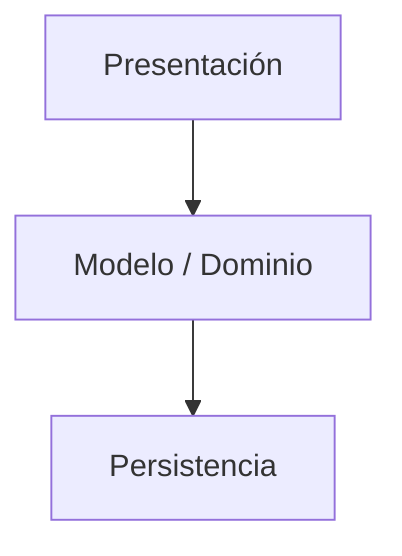
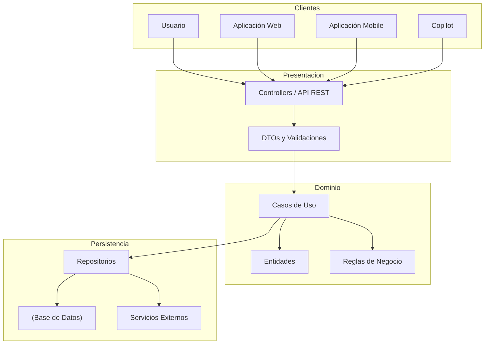
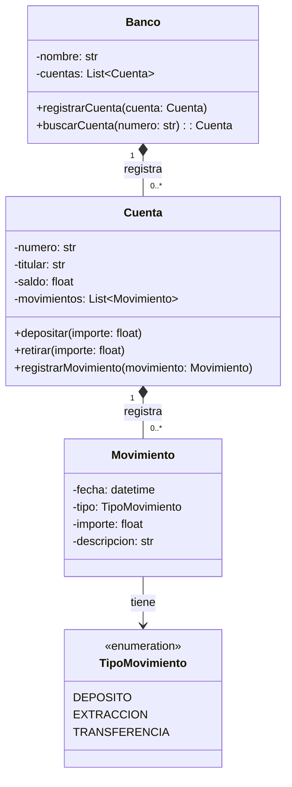

# Clase 14 - 23 de Septiembre del 2026

# Repaso

* POO
  * Consistencia de un objeto
  * Diagramas / UML
    * Diagramas de clase
    * Generacion de diagramas con Mermaid
    * Jugamos con crear modelos de objetos con varias clases
  * Python
    * Clases
      * Creacion de objetos / constructor
        * metodo dunder __init__
        * Asegurar la consistencia desde el momento de la creacion
    * El dunder method str
* AiDev
  * Al usar la IA pedir chequeo de consistencia al generar Clases
  * Suele generar constructores que no aseguran la consistencia del objeto creado

---

# Setup de la clase

* Colab de la clase
  * https://colab.research.google.com/drive/1knT84zyYisCrXPgFqnzzLhWTlqQ4N-uM?usp=sharing

# Programacion Orientada a Objetos

## Consistencia de Objetos

* Momentos en que un objeto se puede volver inconsistente
  * Al momento de la creacion
  * Al momento de uso

 * Ejemplo donde el objeto se vuelve incosistente mientras lo usamos

```python
class Fraccion:
    def __init__(self, numerador : int, denominador : int):
        if denominador == 0:
            raise ValueError("El denominador no puede ser cero")

        self.numerador = numerador
        self.denominador = denominador

    def __str__(self) -> str:
        return f"{self.numerador}/{self.denominador}"


fraccion = Fraccion(1, 2)
print(fraccion)

fraccion.denominador = 0
print(fraccion)
```

* La idea es proteger el objeto duranto todo su ciclo de vida para para poder controlar los cambios  que se hacen sobre sus atriburos para mantener al objeto consistene
* Esto se llama encapsulamiento y y se hace distinto segun el lenguaje

* Nuestra implementacion de Fraccion con encapsulamiento
```python
class Fraccion:
    def __init__(self, numerador : int, denominador : int):
        #if denominador == 0:
        #    raise ValueError("El denominador no puede ser cero")

        self.numerador = numerador
        self.denominador = denominador

    @property
    def numerador(self):
        return self.__numerador

    @numerador.setter
    def numerador(self, numerador):
        self.__numerador = numerador

    @property
    def denominador(self):
        return self.__denominador

    @denominador.setter
    def denominador(self, denominador):
        if denominador == 0:
            raise ValueError("El denominador no puede ser cero")

        self.__denominador = denominador

    def __str__(self) -> str:
        return f"{self.numerador}/{self.denominador}"
```

* Como seria en java
```java
public class Fraccion {
    private int numerador;
    private int denominador;
 
    public Fraccion(int numerador, int denominador) {
        this.setNumerador(numerador);
        this.setDenominador(denominador);
    }
 
    public int getNumerador() {
        return numerador;
    }
 
    public void setNumerador(int numerador) {
        this.numerador = numerador;
    }
 
    public int getDenominador() {
        return denominador;
    }
 
    public void setDenominador(int denominador) {
        if (denominador == 0) {
            throw new IllegalArgumentException("El denominador no puede ser cero");
        }
        this.denominador = denominador;
    }
 
    @Override
    public String toString() {
        return numerador + "/" + denominador;
    }
 
    public static void main(String[] args) {
        Fraccion fraccion = new Fraccion(1, 2);
        System.out.println(fraccion);
 
        try {
            fraccion.setDenominador(0);
        } catch (IllegalArgumentException e) {
            System.out.println("Error capturado: " + e.getMessage());
        }
    }
}
```

* Como seria en c#

```c#
public class Fraccion
{
    private int _numerador;
    private int _denominador;

    public Fraccion(int numerador, int denominador)
    {
        Numerador = numerador;
        Denominador = denominador;
    }

    public int Numerador
    {
        get { return _numerador; }
        set { _numerador = value; }
    }

    public int Denominador
    {
        get { return _denominador; }
        set
        {
            if (value == 0)
            {
                throw new ArgumentException("El denominador no puede ser cero");
            }

            _denominador = value;
        }
    }

    public override string ToString()
    {
        return $"{Numerador}/{Denominador}";
    }
}
```

* El encapsulamiento busca proteger los atriburos para asegurar que no se modifiquen los mismos de forma de que nuestro objeto ya creado se vuelva inconsistente
* Para ocular los atributos y que no se puedan modificar desde afuera
    * Java y C# tienen niveles de visibilidad, se definen los atributos como private
    * Python prefiere en lugar de usar niveles de visibilidad nombrar los atributos __ (dunder), indicando que a ellos no se accede desde afuera
* Para permitir consultar los atributos
    * Java define un getter que se llama get<NombreAtributo>
    * C# agrega el concepto de propiedad y envuelve un atributo entre llaves y agrega un metodo especial llamado get
    * En python los getter reciben el decorador @property
* Para controlar el cambio sobre los atributos
    * Java define un setter que empieza con el prefijo set y se llama igual que el atributo
    * C# agrega el concepto de propiedad y envuelve un atributo entre llaves y agrega un metodo especial llamado set
    * En python los setter reciben el decorador @nombrepropiedad.setter
 
## Mini Ejercicio

* Definir en python una clase persona con Nombre, Edad, Altura
  * El nombre no puede quedar vacio, ni tener espacios, ni tener mas de 20 caracteres, solo caracteres alfanumericos y la primer letra en mayuscula, resto en minuscula
  * La edad tiene que ser mayor a 0, menor a 120 y ser aceptamos solo valores enteros
  * La altura esta entre 0.1 y 3.0 y admite solamente numeros con coma, esta en metros.
  * Asegurar la consistencia al momento de crear el objeto y durante todo el ciclo de vida del mismo

```
class Persona:
    def __init__(self, nombre, edad, altura):
        # Estas asignaciones pasan por los setters de abajo,
        # así que se validan al crear el objeto
        self.nombre = nombre
        self.edad = edad
        self.altura = altura

    # ---------- NOMBRE ----------
    @property
    def nombre(self):
        return self._nombre

    @nombre.setter
    def nombre(self, valor):
        if type(valor) is not str:
            raise TypeError("El nombre tiene que ser texto")
        if valor == "":
            raise ValueError("El nombre no puede estar vacío")
        if len(valor) > 20:
            raise ValueError("El nombre no puede tener más de 20 caracteres")
        if not valor.isalnum():  # esto también rechaza espacios
            raise ValueError("El nombre solo puede tener letras y números, sin espacios")
        if not valor[0].isupper():
            raise ValueError("La primera letra tiene que ser mayúscula")
        if valor[1:] != valor[1:].lower():
            raise ValueError("Después de la primera letra, todo en minúscula")
        self._nombre = valor

    # ---------- EDAD ----------
    @property
    def edad(self):
        return self._edad

    @edad.setter
    def edad(self, valor):
        if type(valor) is not int:
            raise TypeError("La edad tiene que ser un número entero")
        if valor <= 0 or valor >= 120:
            raise ValueError("La edad tiene que ser mayor a 0 y menor a 120")
        self._edad = valor

    # ---------- ALTURA ----------
    @property
    def altura(self):
        return self._altura

    @altura.setter
    def altura(self, valor):
        if type(valor) is not float:
            raise TypeError("La altura tiene que ser un número con coma (ej: 1.75)")
        if valor < 0.1 or valor > 3.0:
            raise ValueError("La altura tiene que estar entre 0.1 y 3.0 metros")
        self._altura = valor

    def __str__(self):
        return f"{self.nombre}, {self.edad} años, {self.altura} m"
```

---
BREAK
HASTA Y 30
---

# Pensar en Objetos

## Arquitectura de Referencia



* Diagrama extendido



## Tipos de Clases clases

* Tenemos distintos tipos de clases
    * Las clases que tienen que ver con cosas de presentacion , visuales (Presentacion)
    * Las que clases que tiene que ver con guardar cosas en la base de datos y comunucarte con sistemas externos (Persistencia)
    * Clases del Dominio / Modelo
      * Son particulares para el sistema que estamos resolviendo
      * Son las que tienen la "logica de negocio"
      * Estas son las clases que le interesan sobre todo la POO
      * Lo ideal es que estas clases no sepan nada ni de la presentacion ni de la persistencia
          * Que sean independientes de la tecnologia (web/escritorio) que se usa en el sistema
          * Asi es mas facil de mantener


# Relaciones entre clases

* Hasta ahora vimos como realizar clases sueltas
* Pero las clases rara vez viven sueltas, sino que colaboran entre si y arman lo que se llama el modelo del sistema
* Vamos a ver un ejemplo de por la parte del dominio de un sistema bancario

* Partamos de la descripcion coloquial de un sistema bancario
   * "Tengo un banco en el cual se registran cuentas y en las cuentas se lleva un registro de los movimientos que se realizan"
   * Cuales son las tres clases mencionadas?
        * banco, cuentas, clientes, movimientos
    
* Le pedimos a la IA
```
A partir de esta descripcion coloquial ""Tengo un banco en el cual se registran cuentas y en las cuentas se lleva un registro de los movimientos que se realizan"" quiero que me hagas el disenio en mermaid del diagrama de clases del dominio / modelo de mi aplicacion
```

* La IA me genero



* Observaciones
  * Entre las clases en UML hay relaciones, que se marcan con una flecha
  * Las relaciones tiene cardinalidad
     * Una cuenta pertenece a 1 banco
     * 1 banco tiene varias cuentas (0..*)
     * 1 movimiento pertenece a una cuenta
     * 1 cuenta tiene varios movimientos

* Suponiendo que este codigo esta bien hacemos una primera version con la IA

```
from datetime import datetime
from enum import Enum


class TipoMovimiento(Enum):
    DEPOSITO = "Depósito"
    EXTRACCION = "Extracción"
    TRANSFERENCIA = "Transferencia"


class Movimiento:
    def __init__(
        self,
        fecha: datetime,
        tipo: TipoMovimiento,
        importe: float,
        descripcion: str
    ):
        self.fecha = fecha
        self.tipo = tipo
        self.importe = importe
        self.descripcion = descripcion


class Cuenta:
    def __init__(self, numero: str, titular: str):
        self.numero = numero
        self.titular = titular
        self.saldo = 0.0
        self.movimientos = []

    def depositar(self, importe: float):
        self.saldo += importe

        movimiento = Movimiento(
            datetime.now(),
            TipoMovimiento.DEPOSITO,
            importe,
            "Depósito"
        )

        self.registrar_movimiento(movimiento)

    def retirar(self, importe: float):
        self.saldo -= importe

        movimiento = Movimiento(
            datetime.now(),
            TipoMovimiento.EXTRACCION,
            importe,
            "Extracción"
        )

        self.registrar_movimiento(movimiento)

    def registrar_movimiento(self, movimiento: Movimiento):
        self.movimientos.append(movimiento)


class Banco:
    def __init__(self, nombre: str):
        self.nombre = nombre
        self.cuentas = []

    def registrar_cuenta(self, cuenta: Cuenta):
        self.cuentas.append(cuenta)

    def buscar_cuenta(self, numero: str) -> Cuenta:
        for cuenta in self.cuentas:
            if cuenta.numero == numero:
                return cuenta

        return None
```

* PEro en funcion de lo que vimos en clase me doy cuenta que si bien la sintaxis es correcta no respeta muchoas de las cosas que vimos en clase
   * No valida la consistencia de los objetos en todo momento
   * No tiene getters y setters
   * A veces los setter no son necesarios (cambiar el numero de una cuenta es incorrecto)

```python
from datetime import datetime
from enum import Enum


class TipoMovimiento(Enum):
    DEPOSITO = "Depósito"
    EXTRACCION = "Extracción"
    TRANSFERENCIA = "Transferencia"


class Movimiento:

    def __init__(
        self,
        tipo: TipoMovimiento,
        importe: float,
        descripcion: str
    ):
        if importe <= 0:
            raise ValueError("El importe debe ser mayor que cero")

        if not descripcion:
            raise ValueError("La descripción no puede estar vacía")

        self.__fecha = datetime.now()
        self.__tipo = tipo
        self.__importe = importe
        self.__descripcion = descripcion

    @property
    def fecha(self):
        return self.__fecha

    @property
    def tipo(self):
        return self.__tipo

    @property
    def importe(self):
        return self.__importe

    @property
    def descripcion(self):
        return self.__descripcion


class Cuenta:

    def __init__(self, numero: str, titular: str):
        if not numero:
            raise ValueError("El número de cuenta no puede estar vacío")

        if not titular:
            raise ValueError("El titular no puede estar vacío")

        self.__numero = numero
        self.__titular = titular
        self.__saldo = 0.0
        self.__movimientos = []

    @property
    def numero(self):
        return self.__numero

    @property
    def titular(self):
        return self.__titular

    @titular.setter
    def titular(self, titular):
        if not titular:
            raise ValueError("El titular no puede estar vacío")

        self.__titular = titular

    @property
    def saldo(self):
        return self.__saldo

    @property
    def movimientos(self):
        return tuple(self.__movimientos)

    def depositar(self, importe: float):
        if importe <= 0:
            raise ValueError("El importe debe ser mayor que cero")

        self.__saldo += importe

        movimiento = Movimiento(
            TipoMovimiento.DEPOSITO,
            importe,
            "Depósito"
        )

        self.__movimientos.append(movimiento)

    def retirar(self, importe: float):
        if importe <= 0:
            raise ValueError("El importe debe ser mayor que cero")

        if importe > self.__saldo:
            raise ValueError("Saldo insuficiente")

        self.__saldo -= importe

        movimiento = Movimiento(
            TipoMovimiento.EXTRACCION,
            importe,
            "Extracción"
        )

        self.__movimientos.append(movimiento)


class Banco:

    def __init__(self, nombre: str):
        if not nombre:
            raise ValueError("El nombre del banco no puede estar vacío")

        self.__nombre = nombre
        self.__cuentas = []

    @property
    def nombre(self):
        return self.__nombre

    @property
    def cuentas(self):
        return tuple(self.__cuentas)

    def registrar_cuenta(self, cuenta: Cuenta):
        if cuenta is None:
            raise ValueError("La cuenta no puede ser None")

        if self.buscar_cuenta(cuenta.numero) is not None:
            raise ValueError("Ya existe una cuenta con ese número")

        self.__cuentas.append(cuenta)

    def buscar_cuenta(self, numero: str):
        for cuenta in self.__cuentas:
            if cuenta.numero == numero:
                return cuenta

        return None
```
